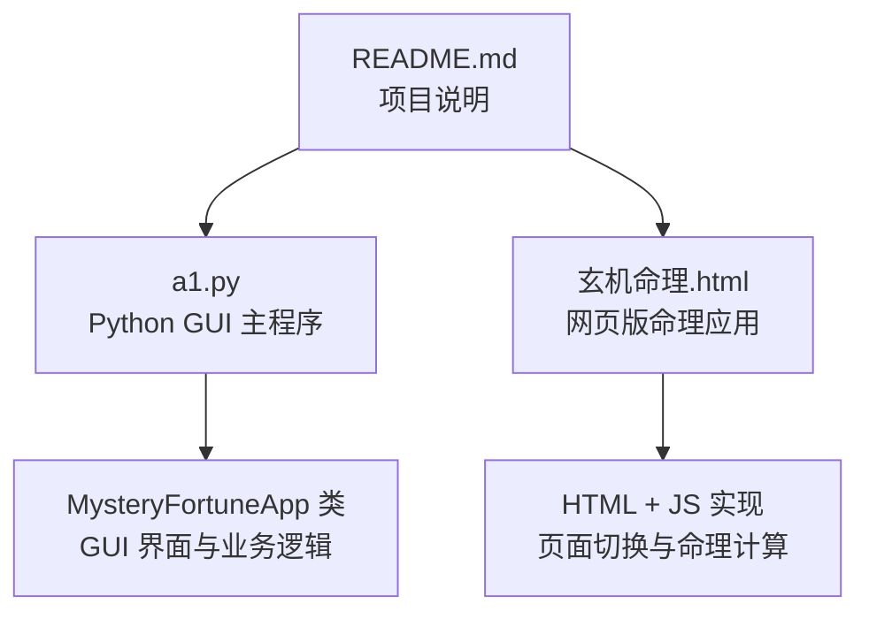
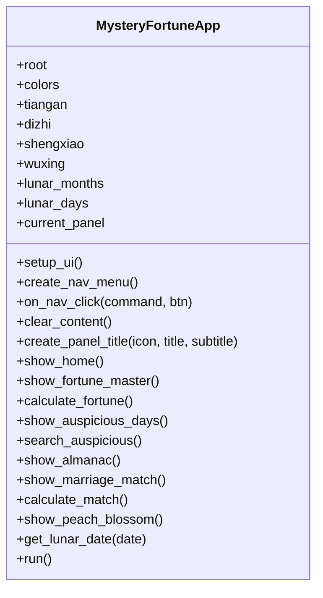
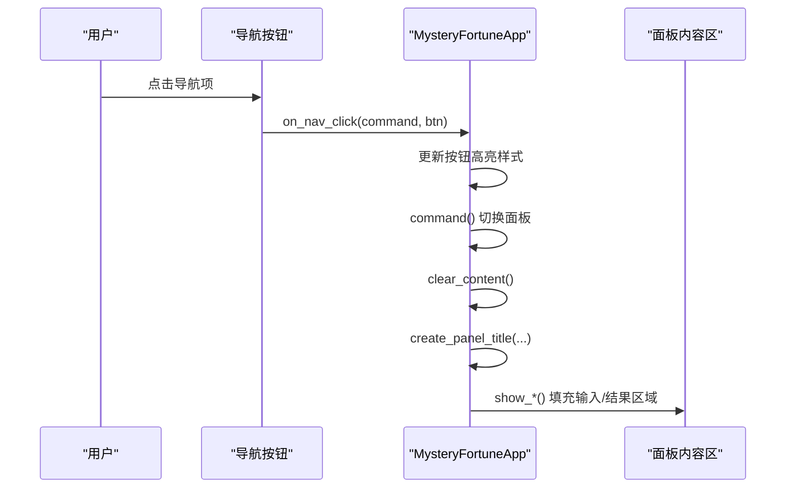
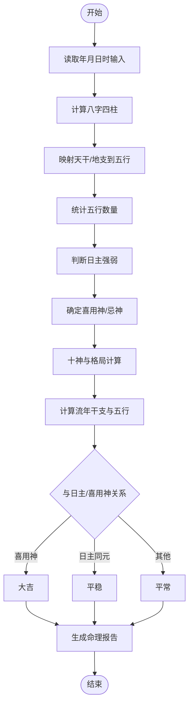
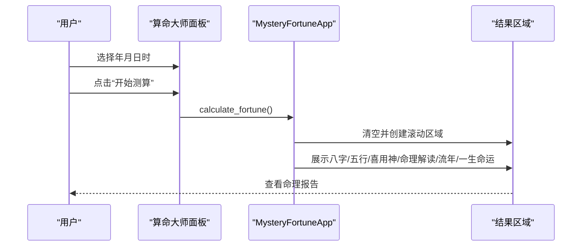
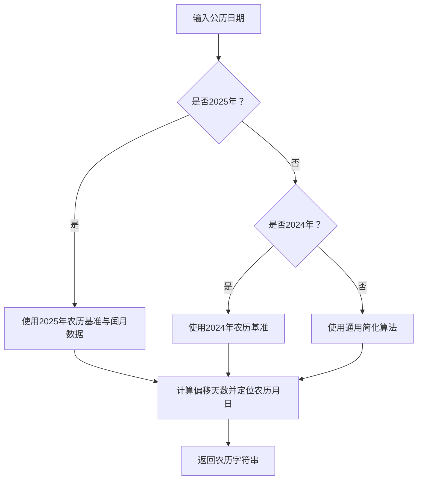
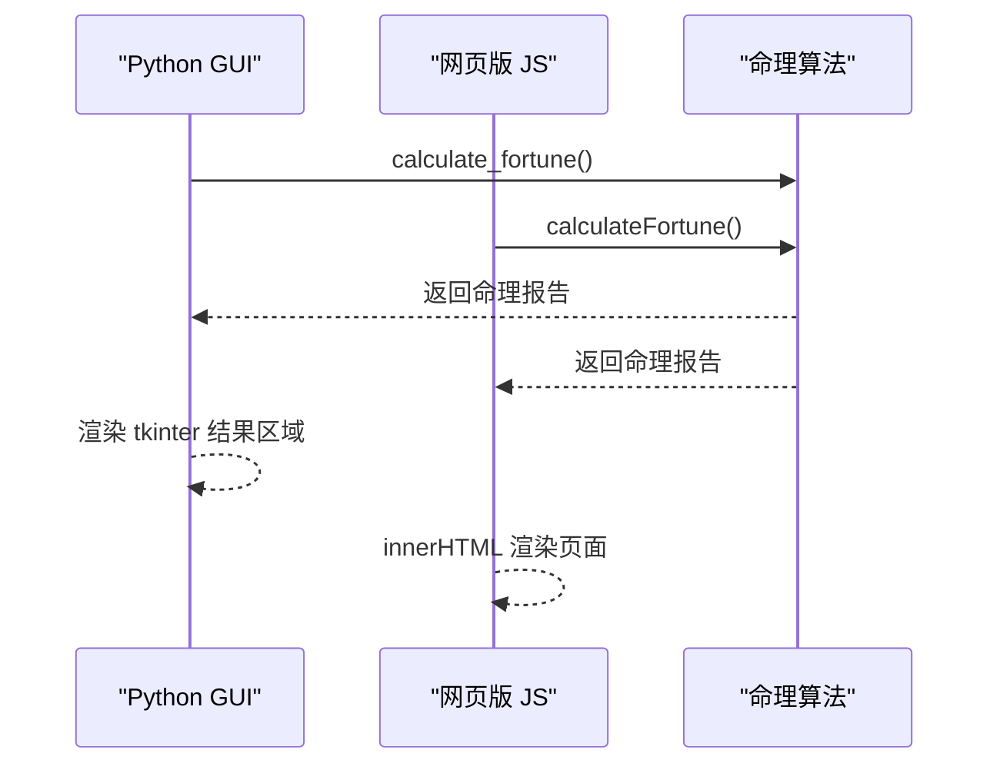
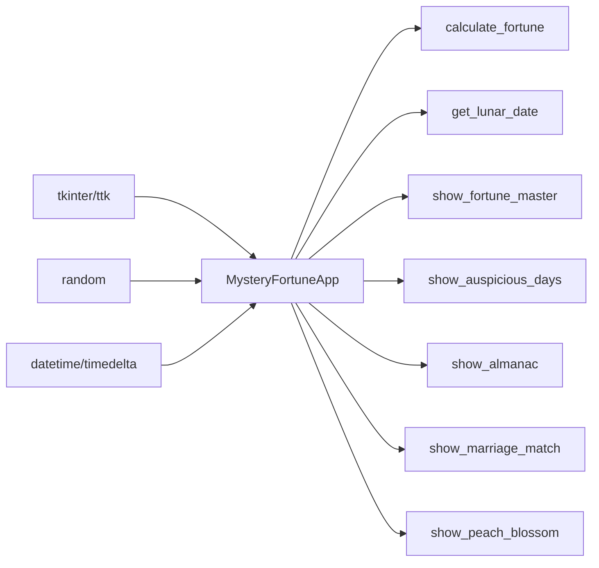

# Python GUI主程序

<cite>
**本文引用的文件**
- [a1.py](file://a1.py)
- [玄机命理.html](file://玄机命理.html)
- [README.md](file://README.md)
</cite>

## 更新摘要
**变更内容**
- 将原有的“今日禁忌”功能更新为“桃花运”功能模块
- 添加了桃花运功能模块的详细说明，包括桃花星计算、桃花运强度分析、大运周期影响及性别修正算法
- 说明了与确定性随机算法的集成
- 更新了UI颜色主题

## 目录
1. [简介](#简介)
2. [项目结构](#项目结构)
3. [核心组件](#核心组件)
4. [架构总览](#架构总览)
5. [详细组件分析](#详细组件分析)
6. [依赖分析](#依赖分析)
7. [性能考量](#性能考量)
8. [故障排查指南](#故障排查指南)
9. [结论](#结论)
10. [附录](#附录)

## 简介
本文件面向“Python GUI主程序”文档目标，深入分析 a1.py 文件中 MysteryFortuneApp 类的结构与行为，重点覆盖：
- 使用 tkinter 构建图形用户界面的窗口布局、按钮事件绑定、输入框处理与结果显示区域
- 内部命理算法逻辑：八字解析、五行统计、日主强弱判断、喜用神与忌神、十神与格局、流年运势推演
- 关键代码路径示例：datetime 库处理出生时间、random 库生成随机命理建议
- 数据流闭环：从用户输入到结果展示的完整流程
- 与“玄机命理.html”中 JavaScript 实现的功能对等性对比与一致性保障
- 调试建议与扩展新功能的方法

## 项目结构
该项目采用单文件 GUI 应用模式，包含一个 Python 主程序与一个 HTML+JS 的网页版本，二者功能对等，便于跨平台体验。

图表来源
- [a1.py](file://a1.py#L1-L120)
- [玄机命理.html](file://玄机命理.html#L316-L446)

章节来源
- [a1.py](file://a1.py#L1-L120)
- [README.md](file://README.md#L1-L3)

## 核心组件
- GUI 应用入口与主窗口：初始化窗口尺寸、背景色、禁用缩放，并设置全局配色方案与天干地支、生肖、五行、农历月份与日期等常量数据。
- 导航菜单：左侧固定宽度导航，支持点击切换不同功能面板。
- 面板容器：右侧内容区，通过 clear_content 与 create_panel_title 统一管理标题与日期信息。
- 命理计算核心：calculate_fortune 方法实现八字解析、五行统计、日主强弱、喜用神与忌神、十神与格局、流年运势与一生命运概述。
- 其他功能面板：黄道吉日、老黄历、婚姻配对、桃花运，均采用统一的滚动结果区域与鼠标滚轮支持。
- 农历日期计算：get_lunar_date 及其辅助方法，支持 2024/2025 年精确农历换算与通用简化算法。

章节来源
- [a1.py](file://a1.py#L9-L1137)

## 架构总览
MysteryFortuneApp 采用“单窗口 + 多面板”的 MVC 思想：
- 视图层：tkinter Frame/Label/Button/Combobox 等控件构成
- 控制器：on_nav_click、各面板的 show_* 方法负责页面切换与输入收集
- 模型层：calculate_fortune 等方法封装命理算法，返回结构化结果
- 输出层：统一的滚动结果区域渲染命理报告

图表来源
- [a1.py](file://a1.py#L9-L1137)

## 详细组件分析

### 1) 界面布局与交互
- 窗口初始化：标题、几何尺寸、背景色、禁用缩放
- 顶部信息栏：副标题与日期信息（含农历）
- 左侧导航菜单：图标+文字，悬停高亮，点击切换面板
- 右侧内容区：统一的 clear_content + create_panel_title + 面板内容
- 滚动区域：Canvas + Scrollbar + bind_all("<MouseWheel>") 支持滚轮滚动

图表来源
- [a1.py](file://a1.py#L90-L120)
- [a1.py](file://a1.py#L121-L158)

章节来源
- [a1.py](file://a1.py#L90-L158)

### 2) 八字解析与命理算法
- 输入：年、月、日、时（Combobox）
- 八字生成：基于年干支、月干支、日干支与时干支的规则计算
- 五行映射与统计：天干与地支分别映射到五行并统计数量
- 日主强弱：根据“生我者”“我生者”“克我者”“我克者”的数量比较判定
- 喜用神与忌神：身强/身弱两种策略，选取相应五行作为参考
- 十神与格局：十神映射表与随机格局生成
- 流年运势：当前年份干支与五行，与日主/喜用神对比，给出“大吉/平稳/平常”
- 一生命运概述：按日主五行与强弱组合生成阶段性运势描述

图表来源
- [a1.py](file://a1.py#L233-L607)

章节来源
- [a1.py](file://a1.py#L233-L607)

### 3) 面板功能与数据流
- 算命大师：输入出生时间 -> calculate_fortune -> 结果滚动区域
- 黄道吉日：选择事项 -> search_auspicious -> 生成近三个月吉日列表
- 老黄历：当日宜忌、冲煞、吉神凶煞、宜忌详解
- 婚姻配对：选择双方生肖 -> calculate_match -> 合契度与详细分析
- 桃花运：输入出生时间与性别 -> calculate_peach_blossom -> 桃花运分析报告

图表来源
- [a1.py](file://a1.py#L190-L232)
- [a1.py](file://a1.py#L233-L607)

章节来源
- [a1.py](file://a1.py#L190-L232)
- [a1.py](file://a1.py#L233-L607)

### 4) 桃花运功能模块
新增的桃花运功能模块实现了对用户姻缘时机的深度分析，其核心算法包括桃花星计算、桃花运强度分析、大运周期影响及性别修正算法，并与确定性随机算法集成。

#### 桃花星计算
桃花星的计算基于用户的出生年份地支，遵循传统命理学规则：
- 寅、午、戌年出生者，桃花星在卯
- 申、子、辰年出生者，桃花星在酉
- 巳、酉、丑年出生者，桃花星在午
- 亥、卯、未年出生者，桃花星在子

该算法通过 `_get_peach_blossom_star` 方法实现，使用字典映射年支索引到对应的桃花星位置。

**章节来源**
- [a1.py](file://a1.py#L1107-L1119)

#### 桃花运强度分析
桃花运强度的计算综合了多个因素：
- **流年地支关系**：若流年地支与桃花星相同（+40%）、六合（+30%）或三合（+25%），则增加相应强度
- **大运周期影响**：10年一运，若大运地支与桃花星相同（+20%）或六合（+15%），则增加强度
- **年龄修正**：青年期（18-35岁）+10%，中年期（36-50岁）+5%
- **性别修正**：女性25-40岁或男性28-45岁时+5%
- **确定性微调**：基于生日种子进行微调（-5%至+5%）

该算法通过 `_calculate_peach_periods` 方法实现，返回用户一生中显著桃花年份的列表。

**章节来源**
- [a1.py](file://a1.py#L1121-L1197)

#### 桃花质量判断
基于强度和年龄，通过 `_get_peach_quality` 方法确定性判断桃花质量：
- **正缘桃花**：强度≥70且成熟度≥70，有望遇到真心人
- **良缘桃花**：强度≥60且成熟度≥55，感情机会较多
- **普通桃花**：强度≥45，有异性缘但不明显
- **浅淡桃花**：强度<45，感情缘分较弱

成熟度根据年龄分段计算基础值，再进行确定性微调。

**章节来源**
- [a1.py](file://a1.py#L1221-L1255)

#### UI与数据流
`show_peach_blossom` 方法创建桃花运界面，包含出生日期输入、性别选择和测算按钮。`calculate_peach_blossom` 方法处理输入，调用上述算法，生成包含基本信息、桃花星解读、一生桃花运时间段和综述的完整分析报告。

**章节来源**
- [a1.py](file://a1.py#L1256-L1537)

### 5) 农历日期计算
- get_lunar_date：优先处理 2024/2025 年精确农历，否则回退到通用算法
- _get_lunar_2024/_get_lunar_2025：基于基准日期累加天数定位农历月日
- _get_lunar_general：简化算法，适配其他年份

图表来源
- [a1.py](file://a1.py#L1057-L1129)

章节来源
- [a1.py](file://a1.py#L1057-L1129)

### 6) 与网页版功能对等性
- 网页版通过 showPage 切换页面，调用 calculateFortune/searchAuspicious/showAlmanac/calculateMatch/calculatePeachBlossom 等函数生成结果
- 命理算法逻辑与数据结构基本一致：天干地支、五行、生肖、农历、流年、格局、解读文案等
- 唯一差异在于 UI 抽象：网页版使用 DOM 操作与 CSS 样式，Python 版使用 tkinter 组件与颜色主题

图表来源
- [a1.py](file://a1.py#L233-L607)
- [玄机命理.html](file://玄机命理.html#L572-L704)

章节来源
- [a1.py](file://a1.py#L233-L607)
- [玄机命理.html](file://玄机命理.html#L572-L704)

## 依赖分析
- 外部库依赖
  - tkinter/ttk/messagebox：GUI 组件与消息提示
  - random：生成随机命理建议与吉日等级
  - datetime/timedelta：出生时间与当前时间处理
  - calendar：辅助日期计算（在本项目中未直接使用）

- 内部耦合
  - 各面板方法共享 clear_content/create_panel_title，降低重复代码
  - 命理算法集中于 calculate_fortune，便于复用与扩展
  - get_lunar_date 作为工具方法被多个面板调用

图表来源
- [a1.py](file://a1.py#L1-L20)
- [a1.py](file://a1.py#L233-L607)

章节来源
- [a1.py](file://a1.py#L1-L20)
- [a1.py](file://a1.py#L233-L607)

## 性能考量
- 计算复杂度
  - 八字解析与五行统计为 O(1)，常数级
  - 命理解读与流年运势为 O(1)，常数级
  - 滚动区域 Canvas + Scrollbar 在大量文本时仍保持线性滚动
- UI 响应
  - 使用 bind_all 绑定鼠标滚轮，避免阻塞主线程
  - clear_content 后重建内容，避免内存泄漏
- 建议
  - 若未来扩展为真实数据库或外部 API，建议引入异步加载与缓存机制
  - 对超长文本可分页或延迟渲染，提升滚动体验

## 故障排查指南
- 缺少 tkinter
  - 现象：导入失败或无法启动 GUI
  - 解决：确认 Python 安装包含 tkinter；在某些 Linux 发行版需安装 python3-tk
  - 参考路径：[a1.py](file://a1.py#L1-L10)
- 运行报错
  - 现象：运行时报错或窗口不显示
  - 排查：检查 Python 版本兼容性；确保文件编码为 UTF-8；确认路径中无中文特殊字符
- 命理结果异常
  - 现象：流年运势与预期不符
  - 排查：核对输入的出生时间与时辰；确认 get_lunar_date 是否返回正确农历
  - 参考路径：[a1.py](file://a1.py#L1057-L1129)
- 扩展新功能
  - 新增面板：复制 show_fortune_master 的结构，使用 create_panel_title + clear_content
  - 新增算法：在 calculate_fortune 或新增方法中实现，保持返回结构化结果
  - 与网页版对齐：对照 玄机命理.html 的算法与文案，确保一致性

章节来源
- [a1.py](file://a1.py#L1-L10)
- [a1.py](file://a1.py#L1057-L1129)

## 结论
MysteryFortuneApp 以清晰的 MVC 结构实现了命理应用的 GUI 版本，涵盖八字解析、五行分析、流年运势与一生命运概述等核心功能。通过统一的滚动结果区域与导航体系，用户可在不同面板间无缝切换。与网页版相比，二者在算法与数据结构上高度一致，仅 UI 抽象不同。本次更新新增了“桃花运”功能模块，实现了对用户姻缘时机的深度分析，包括桃花星计算、桃花运强度分析、大运周期影响及性别修正算法，并与确定性随机算法集成。建议后续在保持算法一致性的同时，逐步引入异步与缓存优化，以提升大规模数据场景下的性能与体验。

## 附录
- 关键代码路径示例（不展示具体代码，仅提供定位）
  - 八字解析与命理算法：[a1.py](file://a1.py#L233-L607)
  - 导航与面板切换：[a1.py](file://a1.py#L90-L158)
  - 农历日期计算：[a1.py](file://a1.py#L1057-L1129)
  - 桃花运功能模块：[a1.py](file://a1.py#L1107-L1537)
  - 网页版命理算法对照：[玄机命理.html](file://玄机命理.html#L572-L704)