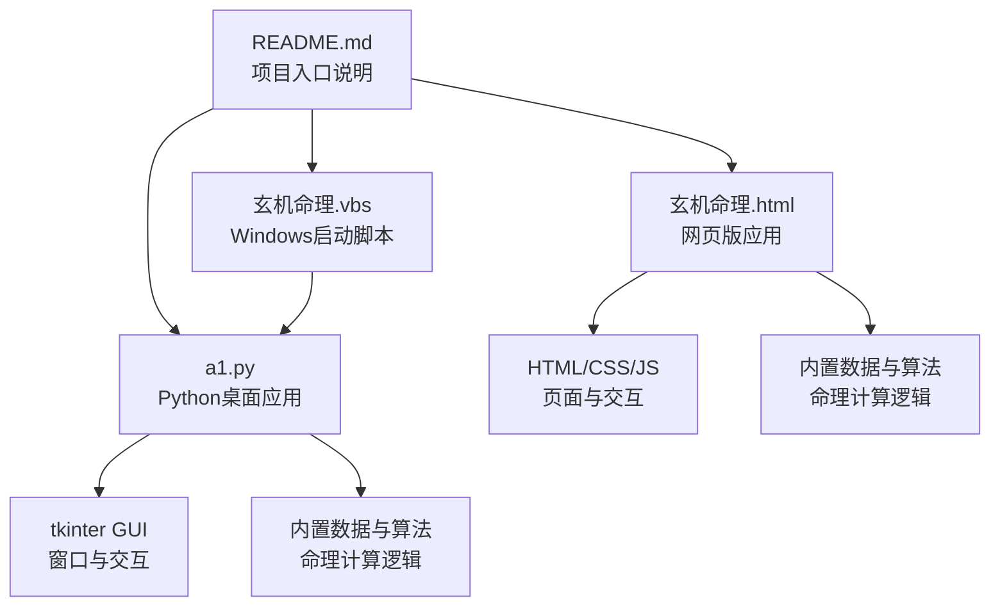
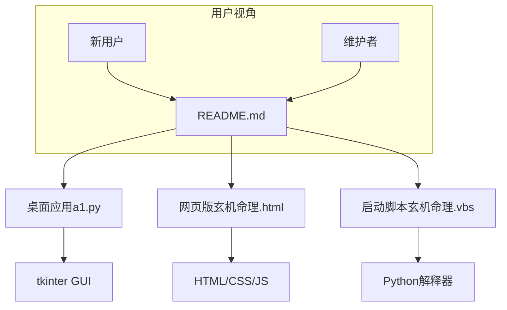
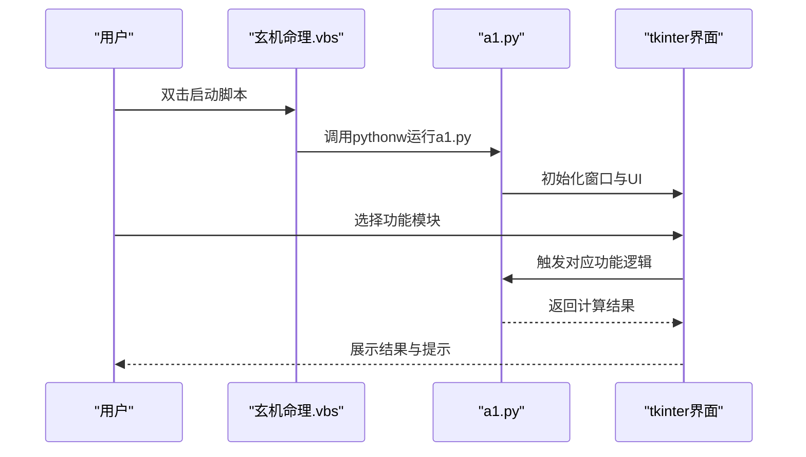
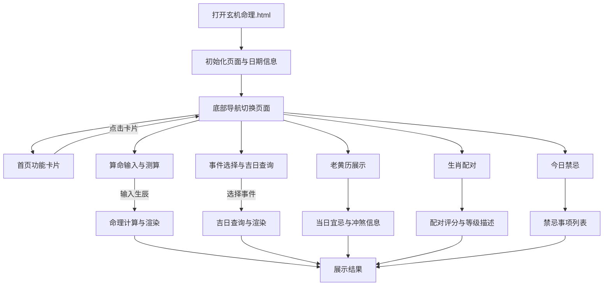
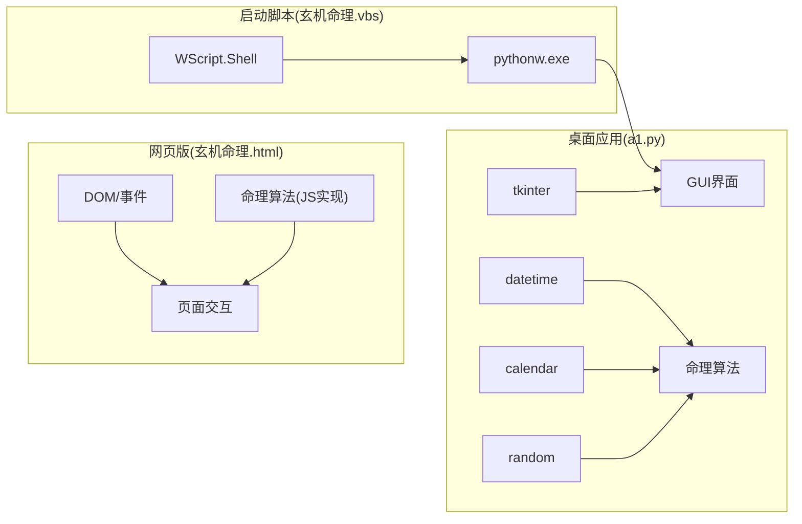

# README说明

<cite>
**本文引用的文件**
- [README.md](file://README.md)
- [a1.py](file://a1.py)
- [玄机命理.html](file://玄机命理.html)
- [玄机命理.vbs](file://玄机命理.vbs)
</cite>

## 目录
1. [引言](#引言)
2. [项目结构](#项目结构)
3. [核心组件](#核心组件)
4. [架构总览](#架构总览)
5. [详细组件分析](#详细组件分析)
6. [依赖分析](#依赖分析)
7. [性能考量](#性能考量)
8. [故障排查指南](#故障排查指南)
9. [结论](#结论)
10. [附录](#附录)

## 引言
本文件围绕仓库中的README.md展开，系统性解析其作为项目“第一入口”的作用与意义。尽管当前仓库的README内容较为简洁，仅包含两条简短的个人练习说明，但结合项目实际实现（桌面应用与网页版两套界面），我们仍可从以下维度深入说明：
- README如何帮助新用户快速上手（功能概览、运行方式、启动路径）
- README在维护者与使用者之间的沟通价值
- README在GitHub/GitLab等平台上的展示与传播作用
- 对README内容的改进建议（若用于更广泛的受众）

此外，本文还将结合仓库中的其他文件（a1.py、玄机命理.html、玄机命理.vbs）对README中涉及的功能与运行方式进行交叉验证与补充说明，确保文档的准确性与实用性。

## 项目结构
仓库采用“多界面实现”的组织方式，包含一个基于Python的桌面应用与一个HTML+JavaScript的网页版应用，以及一个启动脚本。整体结构如下图所示：

图表来源
- [README.md](file://README.md#L1-L3)
- [a1.py](file://a1.py#L1-L60)
- [玄机命理.html](file://玄机命理.html#L1-L120)
- [玄机命理.vbs](file://玄机命理.vbs#L1-L3)

章节来源
- [README.md](file://README.md#L1-L3)
- [a1.py](file://a1.py#L1-L60)
- [玄机命理.html](file://玄机命理.html#L1-L120)
- [玄机命理.vbs](file://玄机命理.vbs#L1-L3)

## 核心组件
- Python桌面应用（a1.py）
  - 使用tkinter构建GUI，提供“算命大师”“黄道吉日”“老黄历”“婚姻配对”“今日禁忌”等功能模块。
  - 内置命理数据与算法，包括天干地支、生肖、五行统计、日主强弱判断、格局分析、流年运势等。
- 网页版应用（玄机命理.html）
  - 使用HTML/CSS/JS实现与桌面版相同的功能，适配移动端底部导航与响应式布局。
  - 内置相同的命理数据与算法，便于在浏览器环境中直接运行。
- Windows启动脚本（玄机命理.vbs）
  - 通过调用pythonw.exe运行a1.py，隐藏控制台窗口，提供双击即可启动的体验。

章节来源
- [a1.py](file://a1.py#L1-L120)
- [玄机命理.html](file://玄机命理.html#L316-L446)
- [玄机命理.vbs](file://玄机命理.vbs#L1-L3)

## 架构总览
从README的视角看，该项目的核心目标是“个人练习编程”，并通过两种界面形态（桌面应用与网页版）满足不同场景下的使用需求。README虽然简短，但明确了项目的定位与后续发展方向，有助于读者快速建立对项目的整体认知。

图表来源
- [README.md](file://README.md#L1-L3)
- [a1.py](file://a1.py#L1-L60)
- [玄机命理.html](file://玄机命理.html#L316-L446)
- [玄机命理.vbs](file://玄机命理.vbs#L1-L3)

## 详细组件分析

### README.md内容解析与作用
- 内容要点
  - “冬哥个人练习编程，，专用仓库。”：明确项目性质为个人练习性质，仓库为专用空间。
  - “先模拟家里、公司两边跑的情景，为以后上班后，家里公司都可以编程；努力 努力 努力！”：说明项目背景与目标，强调“在家/在公司均可编程”的能力准备。
- 作为项目第一入口的作用
  - 快速定位项目性质与目标，帮助新用户在第一时间理解项目用途与适用人群。
  - 为后续的使用与贡献提供方向性指引（例如，关注桌面应用与网页版的差异与选择）。
- 在GitHub/GitLab等平台上的展示与传播
  - README通常位于仓库根目录，是平台默认展示的文档，直接影响仓库的可读性与传播性。
  - 当前内容较为简洁，若能补充功能清单、运行方式、截图示例与使用说明，将显著提升项目的吸引力与可用性。

章节来源
- [README.md](file://README.md#L1-L3)

### Python桌面应用（a1.py）
- 功能模块
  - 算命大师：输入生辰八字，输出命盘、五行、喜用神、命理解读、流年运势等。
  - 黄道吉日：根据事件类型查询近三个月的吉日列表。
  - 老黄历：展示当日宜忌、冲煞、吉神凶煞等信息。
  - 婚姻配对：基于生肖进行配对评分与等级描述。
  - 今日禁忌：展示当日的禁忌事项与注意事项。
- 运行方式
  - 直接运行：python a1.py 或 pythonw a1.py（隐藏控制台）。
  - 双击启动：通过玄机命理.vbs脚本启动，无需打开命令行。
- 用户体验
  - 使用tkinter构建的图形界面，提供清晰的导航与信息展示。
  - 内置滚动区域与日期信息，增强可读性与交互性。

图表来源
- [玄机命理.vbs](file://玄机命理.vbs#L1-L3)
- [a1.py](file://a1.py#L1-L120)

章节来源
- [a1.py](file://a1.py#L1-L200)
- [a1.py](file://a1.py#L610-L800)

### 网页版应用（玄机命理.html）
- 功能模块
  - 与桌面版一致，包含算命、黄道吉日、老黄历、婚姻配对、今日禁忌等。
- 运行方式
  - 直接在浏览器中打开HTML文件即可运行，无需额外依赖。
- 用户体验
  - 采用移动端友好的底部导航与响应式布局，适合在手机端查看与操作。

图表来源
- [玄机命理.html](file://玄机命理.html#L316-L446)
- [玄机命理.html](file://玄机命理.html#L447-L886)

章节来源
- [玄机命理.html](file://玄机命理.html#L316-L446)
- [玄机命理.html](file://玄机命理.html#L447-L886)

### 启动脚本（玄机命理.vbs）
- 作用
  - 通过调用pythonw.exe运行a1.py，隐藏控制台窗口，提供双击即可启动的体验。
- 使用场景
  - 适合不熟悉命令行或希望一键启动的用户。
- 注意事项
  - 需要系统已安装Python且已加入PATH，或脚本所在目录包含Python可执行文件。

章节来源
- [玄机命理.vbs](file://玄机命理.vbs#L1-L3)

## 依赖分析
- Python桌面应用依赖
  - tkinter：用于构建GUI界面。
  - datetime：用于日期与农历计算。
  - calendar：用于日历辅助。
  - random：用于随机生成结果与评分。
- 网页版应用依赖
  - HTML/CSS/JS：用于页面结构、样式与交互逻辑。
  - 内置数据与算法：与桌面版共享命理计算逻辑。
- 启动脚本依赖
  - Windows脚本宿主（WScript.Shell）与Python解释器（pythonw.exe）。

图表来源
- [a1.py](file://a1.py#L1-L60)
- [玄机命理.html](file://玄机命理.html#L447-L570)
- [玄机命理.vbs](file://玄机命理.vbs#L1-L3)

章节来源
- [a1.py](file://a1.py#L1-L60)
- [玄机命理.html](file://玄机命理.html#L447-L570)
- [玄机命理.vbs](file://玄机命理.vbs#L1-L3)

## 性能考量
- 桌面应用（a1.py）
  - 使用tkinter构建界面，性能开销较低，适合本地运行。
  - 命理计算逻辑相对简单，运行时延可控。
- 网页版（玄机命理.html）
  - 通过浏览器渲染，性能受设备与浏览器影响，但在现代设备上通常流畅。
  - 交互逻辑以DOM操作为主，计算量不大。
- 启动脚本（玄机命理.vbs）
  - 启动延迟主要取决于Python解释器加载时间，可通过优化Python环境配置减少等待。

[本节为通用性能讨论，不直接分析具体文件，故无章节来源]

## 故障排查指南
- 启动失败（双击VBS无响应）
  - 检查是否安装Python且已加入系统PATH。
  - 确认脚本路径与a1.py在同一目录。
  - 尝试直接运行pythonw a1.py进行验证。
- 控制台窗口闪烁或关闭过快
  - 使用pythonw运行以隐藏控制台，或在命令行中使用python -i进行调试。
- 功能异常（如日期显示不正确）
  - 检查系统日期设置与时区。
  - 确认datetime模块可用且未被第三方库覆盖。
- 浏览器兼容性问题（网页版）
  - 确保使用支持ES6+与DOM API的现代浏览器。
  - 如遇样式异常，尝试刷新缓存或更换浏览器。

章节来源
- [玄机命理.vbs](file://玄机命理.vbs#L1-L3)
- [a1.py](file://a1.py#L1-L60)
- [玄机命理.html](file://玄机命理.html#L316-L446)

## 结论
- README.md虽然简短，但明确了项目的个人练习性质与“在家/在公司均可编程”的目标，为新用户提供清晰的定位信息。
- 结合a1.py、玄机命理.html与玄机命理.vbs，项目提供了桌面应用与网页版两种使用路径，满足不同用户的偏好与场景需求。
- 若README能补充功能清单、运行环境要求、安装步骤与使用示例，将显著提升项目的可读性、传播性与用户体验。

[本节为总结性内容，不直接分析具体文件，故无章节来源]

## 附录
- 实际操作建议（基于仓库文件）
  - 直接运行桌面应用：在命令行中执行 python a1.py 或 pythonw a1.py。
  - 双击启动：在Windows环境下双击 玄机命理.vbs 文件。
  - 浏览器运行：直接打开 玄机命理.html 文件。
- 截图建议（概念性）
  - 首页功能卡片截图：展示“算命大师”“黄道吉日”“老黄历”“婚姻配对”“今日禁忌”等入口。
  - 算命大师界面截图：展示生辰输入与命理报告输出。
  - 黄道吉日界面截图：展示近三个月吉日列表与评分。
  - 老黄历界面截图：展示当日宜忌、冲煞与吉神凶煞。
  - 婚姻配对界面截图：展示生肖配对评分与等级描述。
  - 今日禁忌界面截图：展示当日禁忌事项列表。
- 使用示例（概念性）
  - 打开桌面应用后，点击“算命大师”，选择出生日期与时辰，点击“开始测算”，查看命理报告。
  - 在“黄道吉日”中选择“结婚嫁娶”，点击“查询吉日”，查看推荐的吉日列表。
  - 在“老黄历”中查看当日宜忌与冲煞，合理安排当日活动。
  - 在“婚姻配对”中选择双方生肖，点击“开始配对”，查看配对评分与等级描述。
  - 在“今日禁忌”中查看当日禁忌事项，规避不利行为。

[本节为概念性建议，不直接分析具体文件，故无章节来源]