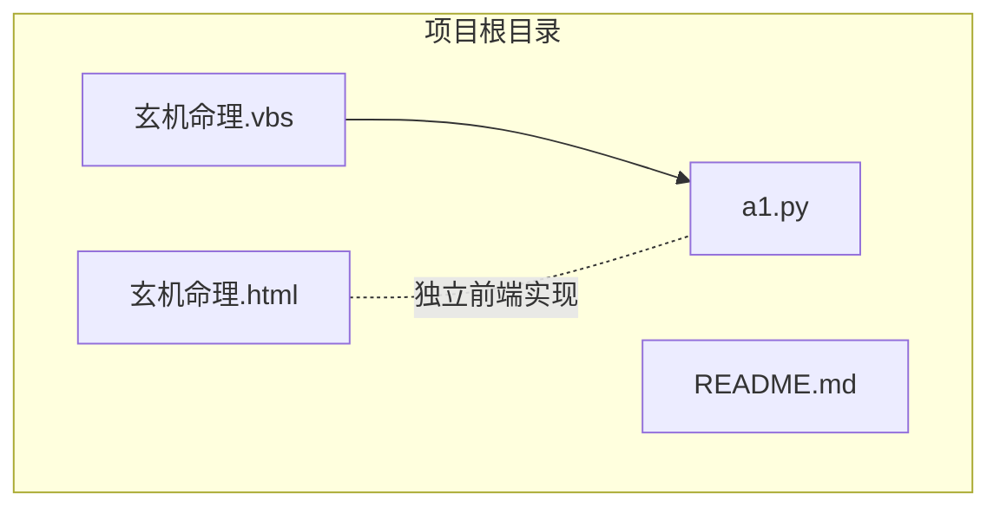
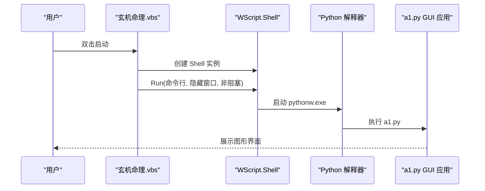
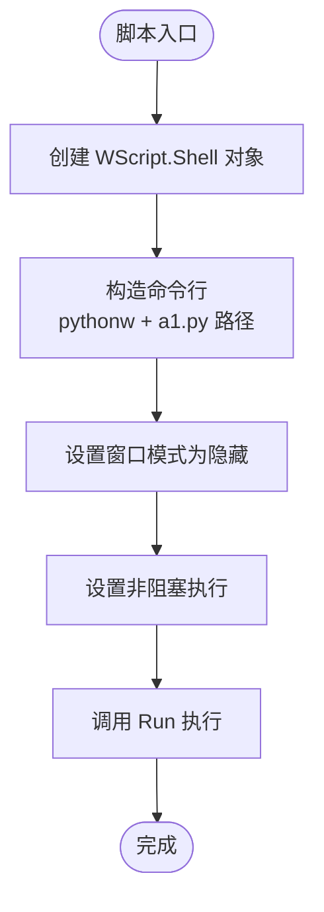
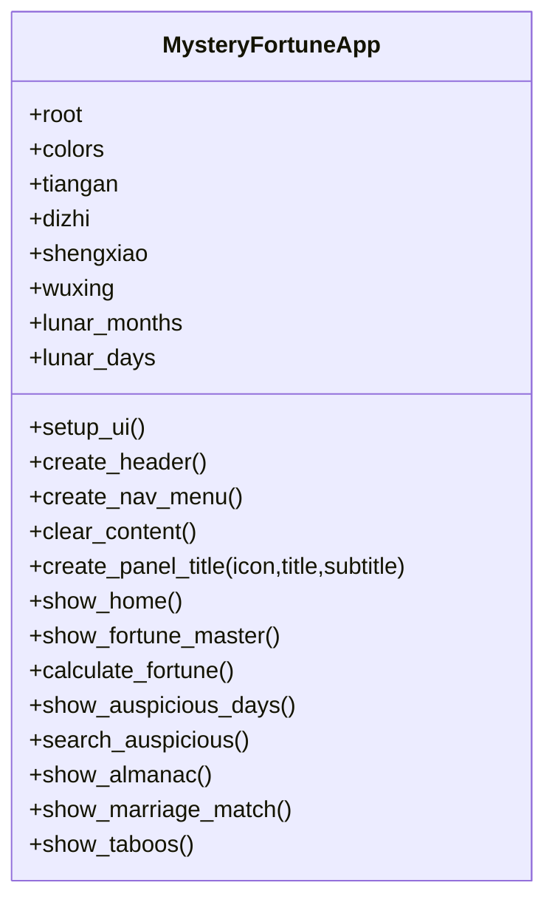
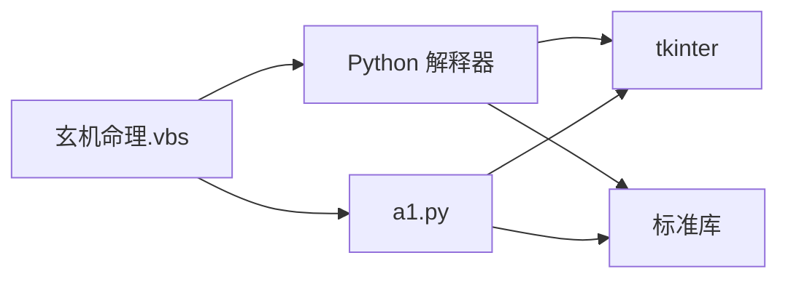

# VBS启动脚本

<cite>
**本文引用的文件**
- [玄机命理.vbs](file://玄机命理.vbs)
- [a1.py](file://a1.py)
- [README.md](file://README.md)
- [玄机命理.html](file://玄机命理.html)
</cite>

## 目录
1. [简介](#简介)
2. [项目结构](#项目结构)
3. [核心组件](#核心组件)
4. [架构总览](#架构总览)
5. [详细组件分析](#详细组件分析)
6. [依赖分析](#依赖分析)
7. [性能考量](#性能考量)
8. [故障排查指南](#故障排查指南)
9. [结论](#结论)
10. [附录](#附录)

## 简介
本文件围绕“玄机命理.vbs”脚本展开，系统性说明其作用、技术实现与使用方式。该脚本通过 Windows Script Host 在后台静默启动 Python 解释器并运行 GUI 应用 a1.py，从而让非技术用户无需打开终端即可直接启动图形界面程序。文档同时提供修改建议、局限性说明、替代方案以及在自动化流程中的集成价值与常见问题排查。

## 项目结构
仓库包含以下关键文件：
- 玄机命理.vbs：Windows VBS 启动脚本，负责静默调用 Python 解释器运行 a1.py。
- a1.py：基于 tkinter 的 GUI 应用，提供命理测算、黄道吉日、老黄历、婚姻配对、今日禁忌等功能。
- README.md：项目背景说明。
- 玄机命理.html：另一个前端实现版本（基于 HTML/CSS/JS），与 VBS 启动脚本共同构成同一产品形态。

图表来源
- [玄机命理.vbs](file://玄机命理.vbs#L1-L3)
- [a1.py](file://a1.py#L1-L120)
- [玄机命理.html](file://玄机命理.html#L1-L120)

章节来源
- [README.md](file://README.md#L1-L3)

## 核心组件
- VBS 启动脚本：使用 WScript.Shell 对象创建系统进程，隐藏窗口执行 Python 解释器，传入 a1.py 作为入口脚本。
- a1.py GUI 应用：提供多种命理功能页面，采用 tkinter 构建界面，包含导航、输入、计算与结果展示。
- README.md：项目背景与用途说明。
- 玄机命理.html：与 VBS 启动脚本并行的网页版前端实现。

章节来源
- [玄机命理.vbs](file://玄机命理.vbs#L1-L3)
- [a1.py](file://a1.py#L1-L120)
- [README.md](file://README.md#L1-L3)
- [玄机命理.html](file://玄机命理.html#L1-L120)

## 架构总览
VBS 启动脚本在 Windows 环境中扮演“启动器”的角色，负责：
- 通过 WSH 创建系统进程
- 使用 pythonw.exe 静默运行 Python 脚本
- 将当前脚本所在目录作为工作目录，定位并运行 a1.py

图表来源
- [玄机命理.vbs](file://玄机命理.vbs#L1-L3)
- [a1.py](file://a1.py#L1-L120)

## 详细组件分析

### VBS 启动脚本分析
- 关键对象与方法
  - WScript.Shell：用于创建系统进程与执行外部命令。
  - Run 方法：执行命令行，支持窗口显示模式与是否等待结束。
- 命令行构造要点
  - 使用 pythonw.exe：避免弹出控制台窗口，实现“静默”启动。
  - 通过 Replace 和 ScriptFullName/ScriptName 计算脚本所在目录，拼接 a1.py 路径，确保跨目录也能正确运行。
  - 参数 0：隐藏窗口模式。
  - 参数 False：非阻塞执行，立即返回。
- 用户体验优化
  - 非技术用户只需双击 .vbs 文件即可启动 GUI，无需手动打开终端或输入命令。
  - 隐藏窗口避免干扰用户操作，符合桌面应用的预期行为。

图表来源
- [玄机命理.vbs](file://玄机命理.vbs#L1-L3)

章节来源
- [玄机命理.vbs](file://玄机命理.vbs#L1-L3)

### a1.py GUI 应用分析
- 技术栈
  - tkinter：构建桌面 GUI，包含主窗口、导航菜单、内容面板与交互控件。
- 功能模块
  - 首页与导航：提供多个功能入口（算命大师、黄道吉日、老黄历、婚姻配对、今日禁忌）。
  - 算命大师：输入生辰八字，计算四柱、五行、日主强弱、喜用神与忌神、流年运势与一生命运概述。
  - 黄道吉日：根据事件类型查询近期吉日，展示日期、农历与吉度等级。
  - 老黄历：展示当日宜忌、冲煞、吉神凶煞等信息。
  - 婚姻配对：基于生肖进行配对评分与等级描述。
  - 今日禁忌：展示当日注意事项与趋吉避凶建议。
- 设计特色
  - 自定义配色与主题风格，强调命理文化氛围。
  - 使用滚动区域与鼠标滚轮支持，提升长内容阅读体验。
  - 多页面切换与响应式布局，适配不同分辨率。

图表来源
- [a1.py](file://a1.py#L1-L120)

章节来源
- [a1.py](file://a1.py#L1-L120)

### HTML 前端实现（对比参考）
- 玄机命理.html 提供与 VBS 启动脚本并行的网页版实现，包含相同的页面与功能逻辑，便于理解 GUI 的页面组织与交互设计。
- 两者共享相同的数据与算法思路，便于维护与迁移。

章节来源
- [玄机命理.html](file://玄机命理.html#L1-L120)

## 依赖分析
- VBS 依赖 Windows Script Host 与 Python 环境
  - 需要系统中存在 pythonw.exe（或 python.exe）以执行 GUI 应用。
  - 若未安装 Python 或未加入 PATH，脚本将无法找到解释器。
- a1.py 依赖 Python 标准库与第三方库
  - tkinter：GUI 构建。
  - 其他标准库：datetime、calendar、random 等。
- 文件位置与路径解析
  - VBS 通过替换脚本路径与名称，定位到 a1.py，要求 a1.py 与 .vbs 放在同一目录或相对路径正确。

图表来源
- [玄机命理.vbs](file://玄机命理.vbs#L1-L3)
- [a1.py](file://a1.py#L1-L120)

章节来源
- [玄机命理.vbs](file://玄机命理.vbs#L1-L3)
- [a1.py](file://a1.py#L1-L120)

## 性能考量
- 启动性能
  - 使用 pythonw.exe 静默启动，避免控制台闪烁，启动体验更佳。
  - 非阻塞执行允许脚本快速返回，减少用户等待时间。
- GUI 性能
  - tkinter 在小型桌面应用中表现稳定，复杂计算建议在后台线程或分步渲染，避免界面卡顿。
- 资源占用
  - GUI 应用通常内存占用较低，适合普通桌面环境运行。

## 故障排查指南
- 问题：脚本无法执行
  - 检查文件关联：确认 .vbs 是否与 WSH 关联。
  - 权限问题：以管理员权限运行或检查组策略限制。
- 问题：找不到 Python
  - 确认 Python 已安装且 pythonw.exe 可用。
  - 将 Python 安装目录加入系统 PATH，或在脚本中显式指定完整路径。
- 问题：a1.py 未找到
  - 确认 a1.py 与 .vbs 放在同一目录。
  - 若移动文件，请同步更新脚本中的路径拼接逻辑。
- 问题：窗口未隐藏
  - 检查 Run 方法第三个参数是否为 False。
  - 确认使用的是 pythonw.exe 而非 python.exe。
- 问题：GUI 无法显示
  - 在命令行中临时运行 pythonw a1.py，观察是否有异常输出。
  - 检查 Python 版本与依赖库是否匹配。

章节来源
- [玄机命理.vbs](file://玄机命理.vbs#L1-L3)
- [a1.py](file://a1.py#L1-L120)

## 结论
“玄机命理.vbs”通过 Windows Script Host 实现了对 Python GUI 应用的静默启动，显著提升了非技术用户的使用体验。其简洁的实现与明确的职责边界使其易于维护与扩展。对于需要进一步提升可用性的场景，可考虑将其集成到自动化启动流程中，并提供更完善的错误提示与日志记录机制。

## 附录

### 修改与定制建议
- 更改 Python 路径
  - 将脚本中的 pythonw 替换为绝对路径，避免依赖 PATH。
- 传递额外参数
  - 在 Run 的命令行字符串中追加参数，供 a1.py 解析。
- 调整窗口行为
  - 将第三个参数改为 True，使脚本等待子进程结束。
  - 将第二个参数改为 1，使窗口可见以便调试。
- 打包为可执行文件
  - 使用工具将 a1.py 打包为 exe，减少对 Python 环境的依赖。
- 自动化集成
  - 将 .vbs 添加到开机自启、任务计划或快捷方式，实现一键启动。

### 平台与兼容性
- 仅限 Windows 平台：依赖 WSH 与 pythonw.exe。
- 替代方案：将 GUI 应用打包为 exe，或使用跨平台虚拟环境与便携式 Python 发布。