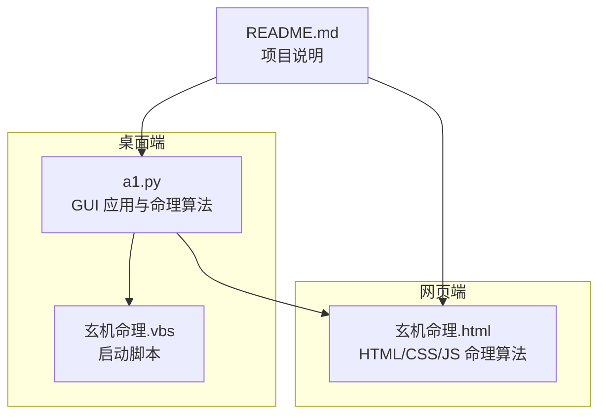
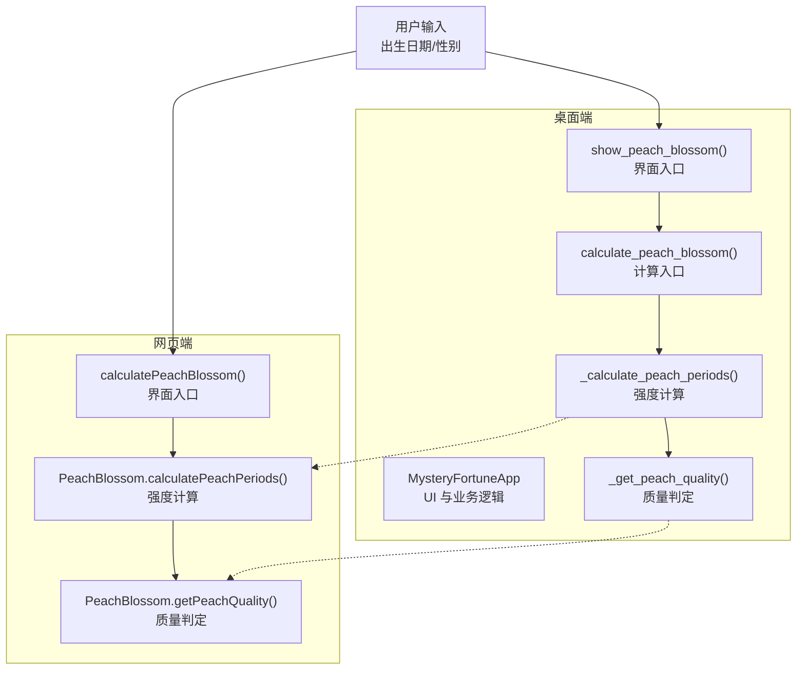
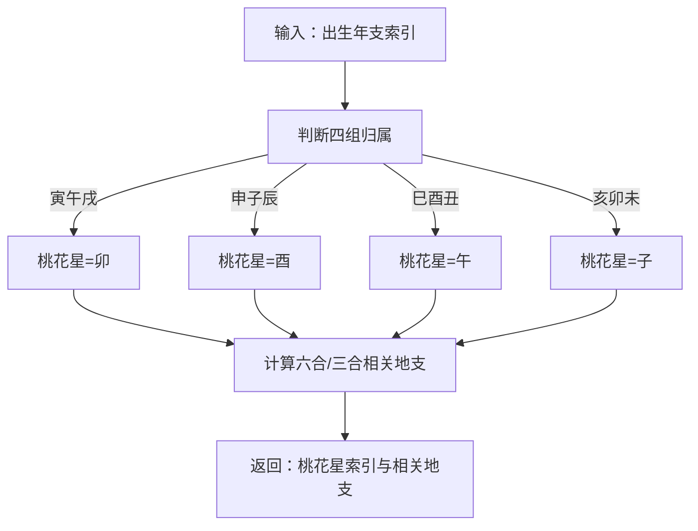
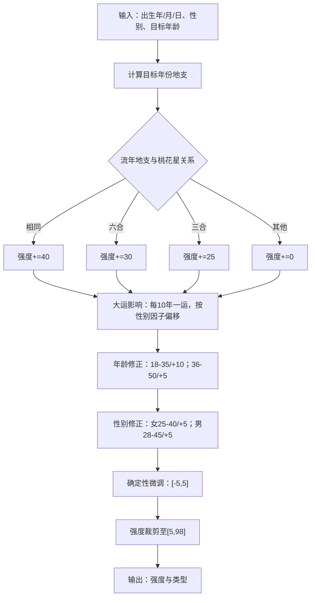
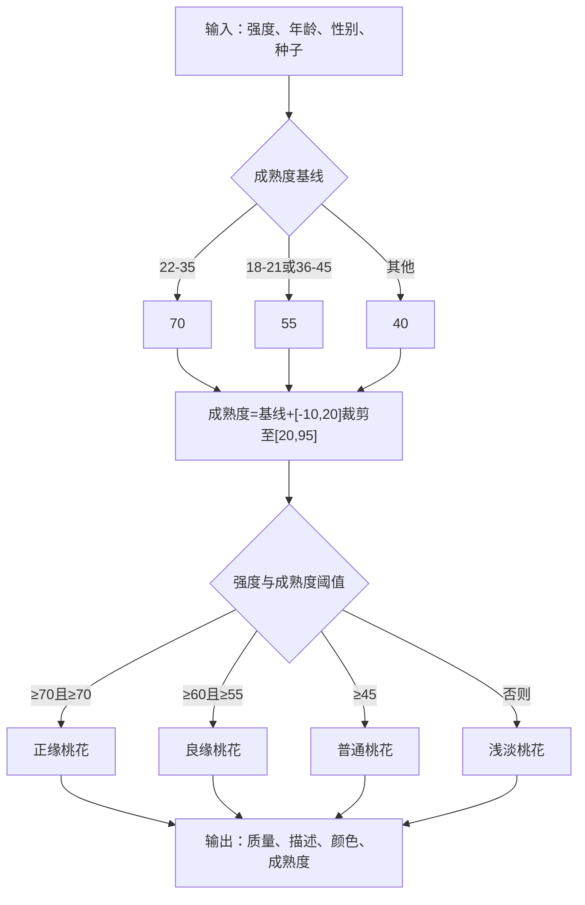
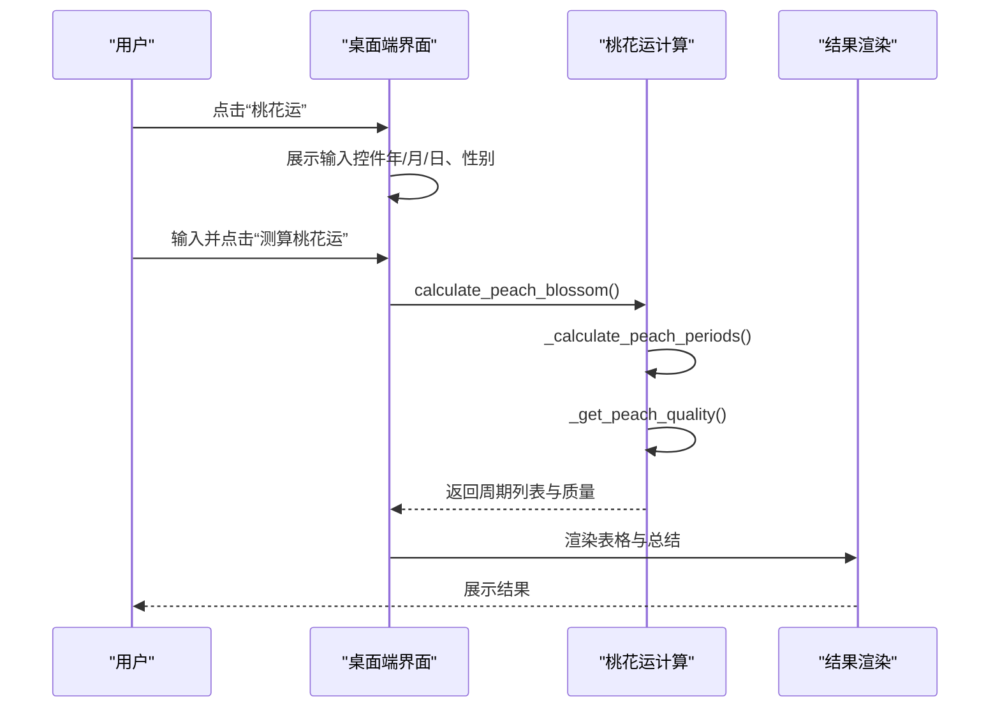
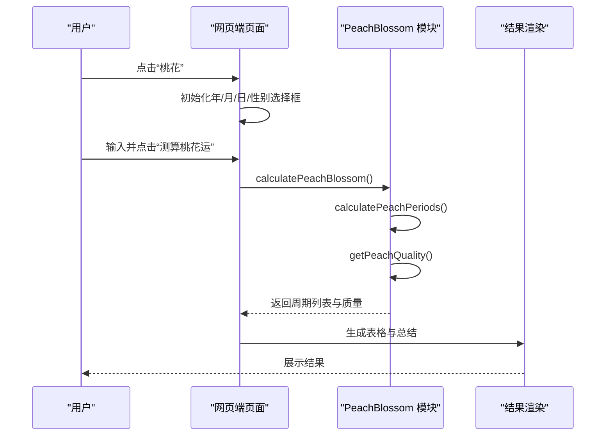
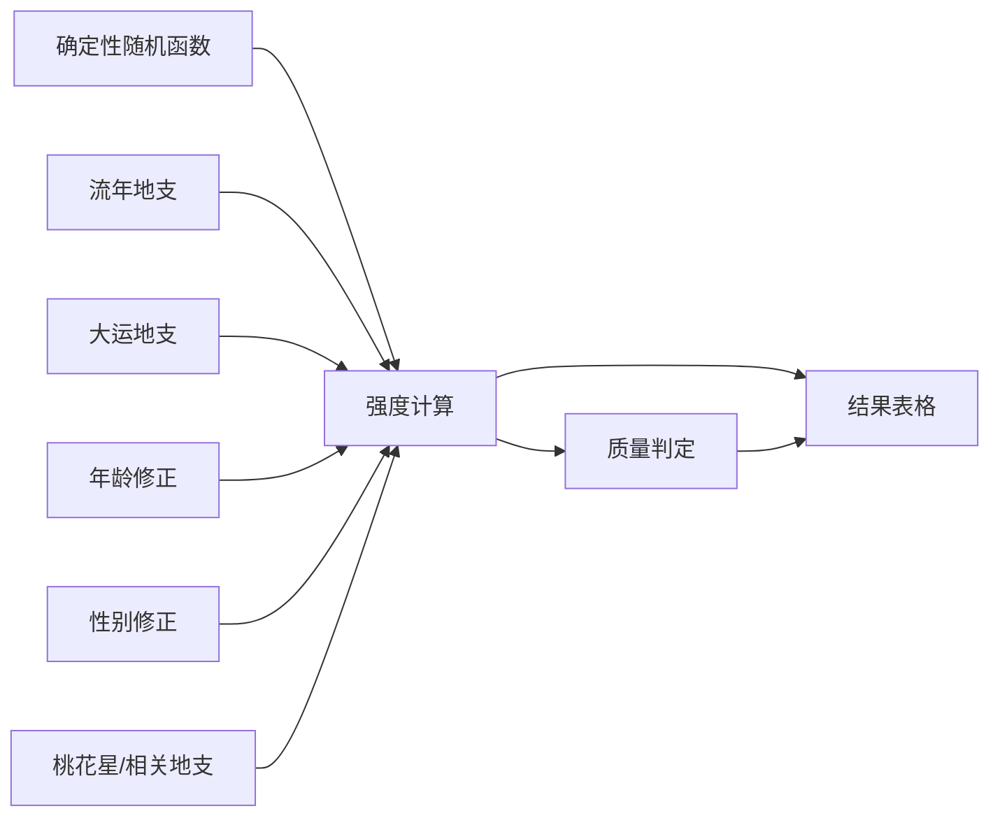

# 桃花运功能

<cite>
**本文引用的文件**
- [README.md](file://README.md)
- [a1.py](file://a1.py)
- [玄机命理.html](file://玄机命理.html)
- [玄机命理.vbs](file://玄机命理.vbs)
</cite>

## 目录
1. [简介](#简介)
2. [项目结构](#项目结构)
3. [核心组件](#核心组件)
4. [架构总览](#架构总览)
5. [详细组件分析](#详细组件分析)
6. [依赖关系分析](#依赖关系分析)
7. [性能考量](#性能考量)
8. [故障排查指南](#故障排查指南)
9. [结论](#结论)
10. [附录](#附录)

## 简介
本项目提供“桃花运”功能，通过传统命理学中的“桃花星”理论，结合流年地支、大运周期、性别差异与年龄阶段，对用户一生中具有显著“桃花运”的时间段进行确定性计算与可视化展示。系统同时提供桌面端（Python Tkinter）与网页端（HTML/JavaScript）两种实现，二者共享相同的命理算法与确定性随机逻辑，确保跨平台一致性。

## 项目结构
- README.md：项目说明与背景
- a1.py：桌面端应用入口，包含完整的 GUI 与命理算法实现
- 玄机命理.html：网页端应用入口，包含 HTML、CSS、JavaScript 与命理算法
- 玄机命理.vbs：Windows 启动脚本，用于以无窗口方式运行桌面端 Python 应用

图表来源
- [a1.py](file://a1.py#L1-L120)
- [玄机命理.html](file://玄机命理.html#L1-L120)
- [玄机命理.vbs](file://玄机命理.vbs#L1-L3)
- [README.md](file://README.md#L1-L3)

章节来源
- [README.md](file://README.md#L1-L3)
- [a1.py](file://a1.py#L1-L120)
- [玄机命理.html](file://玄机命理.html#L1-L120)
- [玄机命理.vbs](file://玄机命理.vbs#L1-L3)

## 核心组件
- 桃花星定位与相关地支计算：根据出生年支确定“桃花星”所在地支，并计算与其六合、三合相关的地支集合
- 桃花运强度计算：基于流年地支与桃花星关系、大运影响、年龄阶段与性别修正，叠加确定性微调，得到每年的“桃花强度”
- 桃花质量判定：结合强度与成熟度阈值，给出“正缘桃花”“良缘桃花”“普通桃花”“浅淡桃花”等质量等级
- 可视化展示：在桌面端与网页端分别以表格、进度条与颜色区分的方式呈现“年龄/年份、强度、桃花质量、成熟度”

章节来源
- [a1.py](file://a1.py#L1107-L1539)
- [玄机命理.html](file://玄机命理.html#L1330-L1606)

## 架构总览
桌面端与网页端共享同一套命理算法，通过“确定性随机”确保相同输入产生一致输出。桌面端采用 Tkinter 构建 UI，网页端采用原生 JavaScript 实现。

图表来源
- [a1.py](file://a1.py#L1257-L1539)
- [玄机命理.html](file://玄机命理.html#L1491-L1606)

章节来源
- [a1.py](file://a1.py#L1257-L1539)
- [玄机命理.html](file://玄机命理.html#L1491-L1606)

## 详细组件分析

### 桃花星与相关地支
- 桃花星规则：根据出生年支所属的“寅午戌/申子辰/巳酉丑/亥卯未”四组，分别对应“卯/酉/午/子”为桃花星所在
- 相关地支：计算与桃花星六合、三合的地支集合，用于后续流年/大运对桃花运的影响判定

图表来源
- [a1.py](file://a1.py#L1107-L1121)
- [玄机命理.html](file://玄机命理.html#L1331-L1366)

章节来源
- [a1.py](file://a1.py#L1107-L1121)
- [玄机命理.html](file://玄机命理.html#L1331-L1366)

### 桃花运强度计算
- 流年影响：当流年地支等于桃花星，强度+40；与桃花星六合，强度+30；与桃花星三合，强度+25
- 大运影响：每10年为一个大运周期，大运地支等于桃花星再+20，六合再+15
- 年龄修正：18-35岁为青年期，额外+10；36-50岁为中年期，额外+5
- 性别修正：女性在25-40岁、男性在28-45岁区间额外+5
- 确定性微调：基于生日种子与年龄序号进行[-5,5]的微调，最终限制在[5,98]

图表来源
- [a1.py](file://a1.py#L1122-L1198)
- [玄机命理.html](file://玄机命理.html#L1368-L1441)

章节来源
- [a1.py](file://a1.py#L1122-L1198)
- [玄机命理.html](file://玄机命理.html#L1368-L1441)

### 桃花质量与成熟度
- 成熟度基线：22-35岁为70，18-21或36-45岁为55，其他为40；在此基础上叠加[-10,20]的确定性微调，裁剪至[20,95]
- 质量等级：
  - 强度≥70 且 成熟度≥70：正缘桃花
  - 强度≥60 且 成熟度≥55：良缘桃花
  - 强度≥45：普通桃花
  - 否则：浅淡桃花

图表来源
- [a1.py](file://a1.py#L1221-L1256)
- [玄机命理.html](file://玄机命理.html#L1444-L1481)

章节来源
- [a1.py](file://a1.py#L1221-L1256)
- [玄机命理.html](file://玄机命理.html#L1444-L1481)

### 界面与交互流程（桌面端）
- 导航点击“桃花运”，进入输入界面（出生日期、性别）
- 点击“测算桃花运”，执行计算并渲染结果表格（年龄/年份、强度进度条、质量、成熟度）

图表来源
- [a1.py](file://a1.py#L1257-L1539)

章节来源
- [a1.py](file://a1.py#L1257-L1539)

### 界面与交互流程（网页端）
- 点击底部导航“桃花”，进入输入界面
- 点击“测算桃花运”，调用计算模块，生成表格与总结

图表来源
- [玄机命理.html](file://玄机命理.html#L1491-L1606)

章节来源
- [玄机命理.html](file://玄机命理.html#L1491-L1606)

## 依赖关系分析
- 桃花星与相关地支依赖于地支索引映射与六合/三合规则
- 强度计算依赖于流年地支、大运地支、年龄与性别修正
- 质量判定依赖于强度与成熟度阈值
- 确定性随机函数保证相同输入产生一致输出，避免伪随机导致的结果漂移

图表来源
- [a1.py](file://a1.py#L80-L110)
- [a1.py](file://a1.py#L1107-L1198)
- [a1.py](file://a1.py#L1221-L1256)
- [玄机命理.html](file://玄机命理.html#L624-L671)
- [玄机命理.html](file://玄机命理.html#L1331-L1441)
- [玄机命理.html](file://玄机命理.html#L1444-L1481)

章节来源
- [a1.py](file://a1.py#L80-L110)
- [a1.py](file://a1.py#L1107-L1198)
- [a1.py](file://a1.py#L1221-L1256)
- [玄机命理.html](file://玄机命理.html#L624-L671)
- [玄机命理.html](file://玄机命理.html#L1331-L1441)
- [玄机命理.html](file://玄机命理.html#L1444-L1481)

## 性能考量
- 确定性随机与缓存：桌面端对每日“冲煎”信息进行缓存，避免重复计算
- 循环范围控制：仅计算18-58岁显著年份，限制输出数量，提升渲染效率
- 前端渲染优化：网页端使用固定列宽与进度条，减少 DOM 重排
- 启动脚本：Windows 启动脚本以无窗口方式运行 Python，避免命令行闪烁

章节来源
- [a1.py](file://a1.py#L1612-L1676)
- [a1.py](file://a1.py#L1382-L1493)
- [玄机命理.html](file://玄机命理.html#L1511-L1546)
- [玄机命理.vbs](file://玄机命理.vbs#L1-L3)

## 故障排查指南
- 输入校验失败：桌面端与网页端均对日期范围进行校验，若输入无效会提示错误信息
- 结果为空或异常：检查输入年份是否在有效范围内；确认性别选择正确
- 网页端无法显示：确认浏览器支持与脚本加载正常；检查控制台是否有错误
- 桌面端无法运行：确认已安装 Python 与 Tkinter；通过启动脚本运行

章节来源
- [a1.py](file://a1.py#L1313-L1327)
- [a1.py](file://a1.py#L1491-L1500)
- [玄机命理.html](file://玄机命理.html#L1491-L1500)
- [玄机命理.vbs](file://玄机命理.vbs#L1-L3)

## 结论
“桃花运”功能以传统命理学为基础，结合确定性算法与可视化展示，为用户提供可复现、可解释的一生桃花运分析。桌面端与网页端在算法层面保持一致，便于用户在不同环境下使用。通过年龄、性别、大运与流年等维度的综合评估，系统能够识别关键的“桃花旺年”，并给出质量与成熟度的分级建议，帮助用户把握感情时机。

## 附录
- 确定性随机函数：基于种子的 sin 波形取小数部分，确保相同输入产生一致输出
- 桃花星规则：按年支所属四组确定桃花星所在地支
- 相关地支：六合与三合地支集合用于流年/大运影响判定
- 成熟度与质量：以强度与成熟度阈值划分等级

章节来源
- [a1.py](file://a1.py#L80-L110)
- [a1.py](file://a1.py#L1107-L1121)
- [a1.py](file://a1.py#L1221-L1256)
- [玄机命理.html](file://玄机命理.html#L624-L671)
- [玄机命理.html](file://玄机命理.html#L1331-L1366)
- [玄机命理.html](file://玄机命理.html#L1444-L1481)