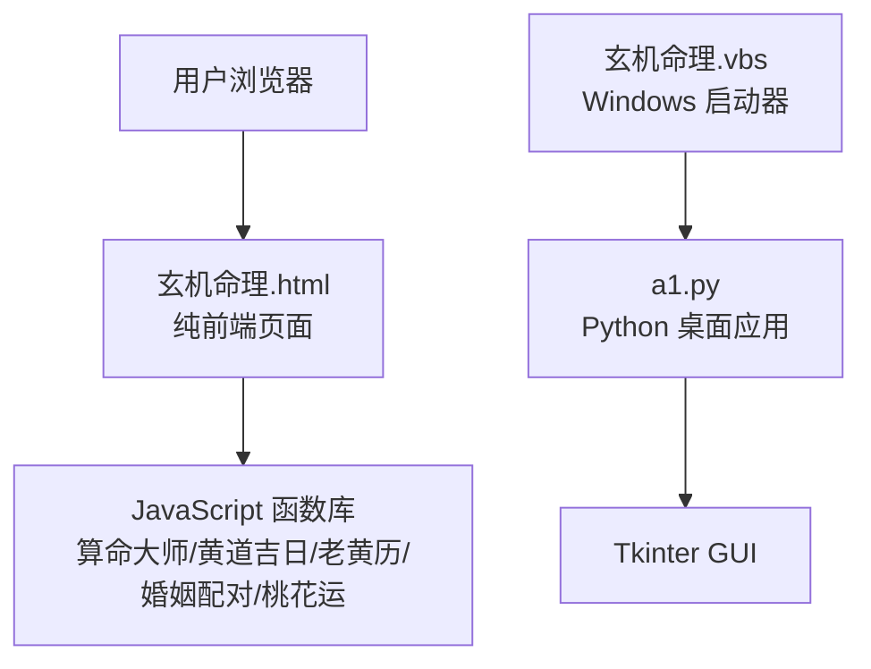
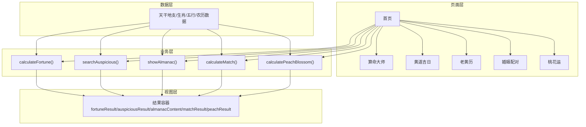
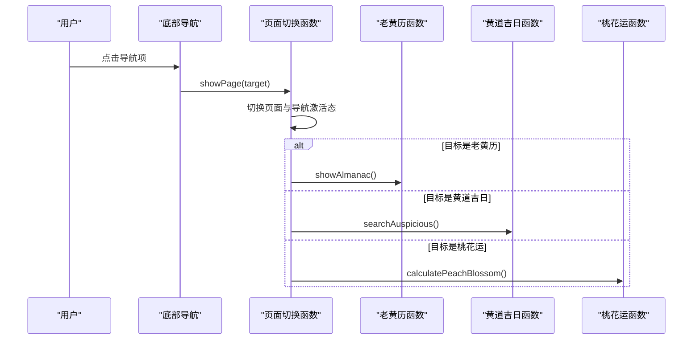
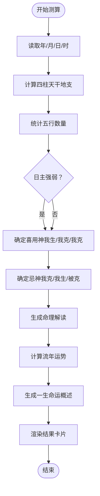
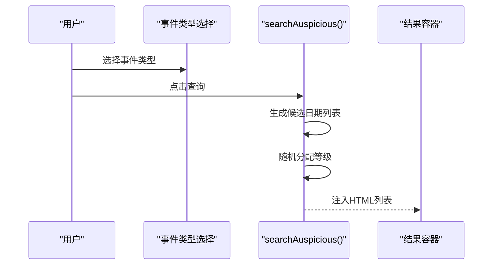
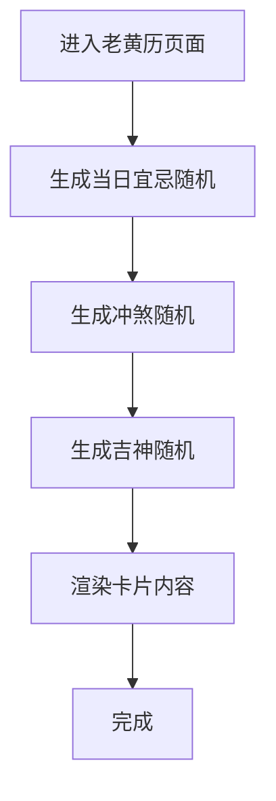
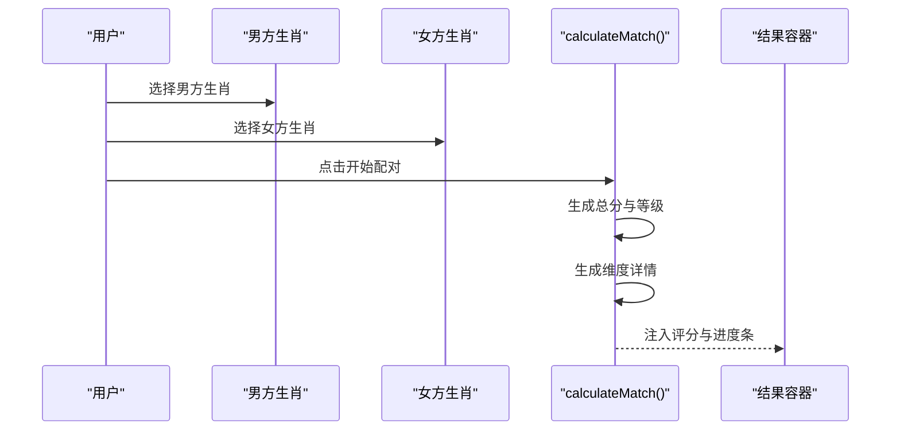
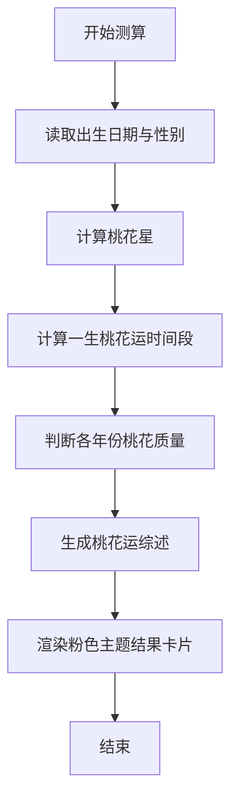
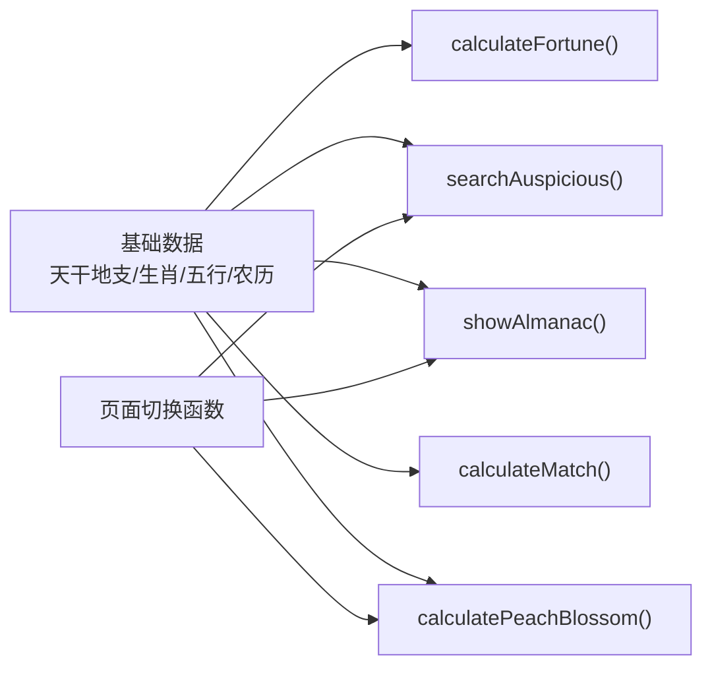

# 网页应用主文件

<cite>
**本文引用的文件**
- [玄机命理.html](file://玄机命理.html)
- [a1.py](file://a1.py)
- [README.md](file://README.md)
- [玄机命理.vbs](file://玄机命理.vbs)
</cite>

## 更新摘要
**变更内容**
- 新增“桃花运”功能模块，包括导航项、输入表单、结果展示区域及粉色主题样式。
- 移除已废弃的“今日禁忌”功能相关说明。
- 更新JavaScript中与Python后端一致的确定性算法实现，确保结果一致性。
- 同步了“算命大师”功能的命理解读部分，新增了综合命运、少年运势、中年运势和晚年运势的详细分析。
- 增强了流年运势展示，细化为财运、事业、感情和健康四个维度的预测。
- 同步了与Python GUI版本的功能一致性，确保网页版与桌面版在核心算法和数据结构上保持一致。
- 更新了相关函数调用关系和数据处理流程的描述，以反映最新实现。

## 目录
1. [简介](#简介)
2. [项目结构](#项目结构)
3. [核心组件](#核心组件)
4. [架构总览](#架构总览)
5. [详细组件分析](#详细组件分析)
6. [依赖分析](#依赖分析)
7. [性能考量](#性能考量)
8. [故障排查指南](#故障排查指南)
9. [结论](#结论)
10. [附录](#附录)

## 简介
本文档是对“网页版命理工具”的全面解析，围绕 HTML 页面结构、内联 CSS 样式设计原则、JavaScript 脚本如何实现与 Python 版本相同的命理计算逻辑展开。重点分析以下函数的调用关系与数据处理流程：
- **算命大师**：输入生辰八字，计算四柱、五行分布、日主强弱、喜用神与忌神、命理解读、流年运势等，并新增综合命运、少年运势、中年运势和晚年运势的详细分析。
- **黄道吉日**：根据用户选择的事项类型，随机生成近期吉日列表。
- **老黄历**：展示当日宜忌、冲煞、吉神等信息。
- **婚姻配对**：根据双方生肖生成契合度评分与维度详情。
- **桃花运**：新增功能，根据用户出生日期和性别，预测一生中的桃花运时间段、桃花质量与姻缘时机，采用粉色主题样式。

同时说明该网页如何通过浏览器原生能力实现跨平台访问，无需额外安装 Python 环境；对比其与 Python 版本在用户体验、性能表现与功能完整性上的异同；并提供在浏览器中调试该文件的方法与常见兼容性问题提示。

## 项目结构
该项目采用“网页应用 + Python 桌面应用”双形态，便于不同场景使用：
- **网页版**：纯前端 HTML/CSS/JS，直接在浏览器运行，无需 Python 环境。
- **Python 桌面版**：使用 Tkinter 构建 GUI，功能更丰富，包含滚动视图、详细解读与更多面板。
- **辅助脚本**：VBS 启动器用于在 Windows 环境下快速运行 Python 版本。

**图表来源**
- [玄机命理.html](file://玄机命理.html#L1-L120)
- [a1.py](file://a1.py#L1-L120)
- [玄机命理.vbs](file://玄机命理.vbs#L1-L3)

**章节来源**
- [README.md](file://README.md#L1-L3)
- [玄机命理.html](file://玄机命理.html#L1-L120)
- [a1.py](file://a1.py#L1-L120)
- [玄机命理.vbs](file://玄机命理.vbs#L1-L3)

## 核心组件
- **页面结构与导航**
  - 顶部标题与日期信息展示。
  - 底部固定导航栏，支持首页、算命、老黄历、配对、桃花五个页面切换。
  - 首页功能网格：包含“算命大师”“黄道吉日”“老黄历”“婚姻配对”“桃花运”入口。
- **输入与交互**
  - **算命大师**：年、月、日、时四列选择框；点击“开始测算”触发计算。
  - **黄道吉日**：事件类型下拉选择；点击“查询”生成吉日列表。
  - **婚姻配对**：男方与女方生肖选择；点击“开始配对”生成评分与维度详情。
  - **桃花运**：出生年、月、日选择框及性别选择；点击“测算桃花运”生成桃花运分析报告。
- **结果渲染**
  - 使用内联 CSS 的卡片式布局，按功能模块分段展示结果。
  - 通过 DOM 操作动态更新各页面的结果容器。

**章节来源**
- [玄机命理.html](file://玄机命理.html#L316-L445)
- [玄机命理.html](file://玄机命理.html#L515-L570)

## 架构总览
网页应用采用“页面切换 + 功能函数”的前端架构：
- **页面切换**：通过统一的页面切换函数控制页面与导航项的激活状态。
- **数据层**：内置天干地支、生肖、五行、农历等基础数据。
- **业务层**：各功能函数负责数据处理与结果渲染。
- **视图层**：内联 CSS 控制布局与主题风格，结果以 HTML 字符串拼接方式注入。

**图表来源**
- [玄机命理.html](file://玄机命理.html#L515-L570)
- [玄机命理.html](file://玄机命理.html#L572-L883)

## 详细组件分析

### 页面切换与初始化
- **页面切换函数**负责隐藏所有页面并激活目标页面，同时同步底部导航项的激活状态。
- **初始化函数**负责：
  - 设置顶部日期信息（公历与农历）。
  - 生成生辰输入框的选项（年、月、日、时）。
  - 生成生肖下拉选项。
  - 生成桃花运输入框的选项（年、月、日）。
- 首次进入“老黄历”“黄道吉日”“桃花运”页面时，会自动触发对应展示逻辑。

**图表来源**
- [玄机命理.html](file://玄机命理.html#L515-L570)
- [玄机命理.html](file://玄机命理.html#L736-L776)
- [玄机命理.html](file://玄机命理.html#L827-L879)
- [玄机命理.html](file://玄机命理.html#L1330-L1606)

**章节来源**
- [玄机命理.html](file://玄机命理.html#L515-L570)
- [玄机命理.html](file://玄机命理.html#L531-L570)

### 算命大师（四柱八字与命理解析）
- **输入**：年、月、日、时四个数值。
- **计算步骤**：
  - 计算年柱、月柱、日柱、时柱的天干地支。
  - 统计天干地支对应的五行数量，得到日主五行与五行分布。
  - 判断日主强弱（生助与耗泄对比）。
  - 基于强弱确定喜用神与忌神。
  - 生成命理解读与流年运势（根据当前年份的天干地支五行与日主关系判定）。
- **结果渲染**：以卡片形式展示八字命盘、五行分布、喜用神与忌神、命理解读、流年运势与提示语。新增“一生命运概述”卡片，包含综合命运、少年运势、中年运势和晚年运势的详细分析。

**图表来源**
- [玄机命理.html](file://玄机命理.html#L572-L816)

**章节来源**
- [玄机命理.html](file://玄机命理.html#L572-L816)

### 黄道吉日（事件类型与吉日列表）
- **输入**：事件类型（如结婚嫁娶、搬家入宅、开业开张、出行远行、签约交易）。
- **计算步骤**：
  - 以当前时间为起点，按一定间隔生成若干候选日期。
  - 对每个候选日期生成随机等级（大吉/上吉/中吉）。
  - 返回包含日期、农历、等级的列表。
- **结果渲染**：以列表卡片形式展示，包含日期、农历与等级。

**图表来源**
- [玄机命理.html](file://玄机命理.html#L706-L734)

**章节来源**
- [玄机命理.html](file://玄机命理.html#L706-L734)

### 老黄历（宜忌、冲煞、吉神）
- **计算步骤**：
  - 生成当日宜与忌的若干条目（随机选取）。
  - 生成当日冲某生肖与煞向（随机生成）。
  - 生成吉神名称（随机选取）。
- **结果渲染**：以卡片形式展示日期大字、年月周、农历、干支、宜忌、冲煞与吉神等信息。

**图表来源**
- [玄机命理.html](file://玄机命理.html#L736-L776)

**章节来源**
- [玄机命理.html](file://玄机命理.html#L736-L776)

### 婚姻配对（生肖评分与维度详情）
- **输入**：男方与女方生肖。
- **计算步骤**：
  - 生成总分（60~100）与等级（天作之合/上等婚配/中等婚配/需要磨合）。
  - 生成多个维度的分数（如性格相合度、价值观契合、生活习惯、财运互补）。
- **结果渲染**：以评分与等级展示，并以进度条形式呈现各维度得分。

**图表来源**
- [玄机命理.html](file://玄机命理.html#L778-L825)

**章节来源**
- [玄机命理.html](file://玄机命理.html#L778-L825)

### 桃花运（桃花星、运势分析与质量判断）
- **输入**：出生年、月、日及性别。
- **计算步骤**：
  - **确定桃花星**：根据年支，按“寅午戌在卯，申子辰在酉，巳酉丑在午，亥卯未在子”的规则确定桃花星位置。
  - **计算桃花运强度**：基于流年地支与桃花星的关系（本位、六合、三合）、大运周期、年龄、性别等因素综合计算。
  - **判断桃花质量**：结合桃花运强度与命主年龄，判断为“正缘桃花”、“良缘桃花”、“普通桃花”或“浅淡桃花”。
  - **生成综述**：统计一生中桃花运显著的年份，给出基于性别的建议。
- **结果渲染**：以粉色主题卡片展示，包含命主信息、桃花星解读、一生桃花运时间轴（含强度进度条、质量、成熟度）及综述。

**图表来源**
- [玄机命理.html](file://玄机命理.html#L1330-L1606)
- [a1.py](file://a1.py#L1107-L1537)

**章节来源**
- [玄机命理.html](file://玄机命理.html#L1330-L1606)

## 依赖分析
- **内置数据依赖**
  - 天干地支、生肖、五行、农历、星期等基础数据均在页面内定义，供各功能函数使用。
- **函数间依赖**
  - 页面切换函数依赖于各功能函数（老黄历、黄道吉日、桃花运）。
  - 各功能函数依赖于基础数据与日期工具（如农历转换）。
- **与 Python 版本的关系**
  - 网页版与 Python 版本共享相同的核心算法与数据结构，但网页版通过浏览器原生 API 实现，无需 Python 环境。
  - Python 版本使用 Tkinter 构建 GUI，功能更丰富（如滚动视图、更详细的解读与面板），但体积较大且需要安装 Python 环境。

**图表来源**
- [玄机命理.html](file://玄机命理.html#L448-L514)
- [玄机命理.html](file://玄机命理.html#L515-L570)

**章节来源**
- [玄机命理.html](file://玄机命理.html#L448-L514)
- [玄机命理.html](file://玄机命理.html#L515-L570)

## 性能考量
- **浏览器端计算**
  - 所有计算在浏览器中完成，避免网络请求，响应速度快。
  - 使用数组与对象进行数据处理，复杂度较低，适合移动端与低端设备。
- **渲染策略**
  - 通过字符串拼接与 DOM 插入渲染结果，简单高效。
  - 首屏加载仅包含一个 HTML 文件，无需额外资源。
- **与 Python 版本对比**
  - **用户体验**：网页版无需安装 Python，跨平台可用；Python 版本功能更丰富，界面更完整。
  - **性能表现**：网页版在低端设备上仍可流畅运行；Python 版本在桌面环境下可提供更丰富的交互与可视化。
  - **功能完整性**：Python 版本包含滚动视图、更详细的命理解读与面板；网页版以简洁卡片式布局为主，功能覆盖主要核心。

[本节为通用性能讨论，不直接分析具体文件，故无章节来源]

## 故障排查指南
- **在浏览器中调试**
  - 打开开发者工具（F12 或右键检查元素），切换到“Console”标签查看控制台输出。
  - 在相关函数处设置断点，逐步执行以观察变量变化与分支逻辑。
  - 使用 Elements 面板查看结果容器是否正确插入 HTML。
- **常见问题**
  - 页面未显示结果：确认页面切换函数已正确调用对应功能函数；检查结果容器 ID 是否匹配。
  - 生辰输入异常：确认年、月、日、时选择框的值范围与默认值设置。
  - 农历日期异常：检查农历转换函数的边界条件与闰月处理。
- **兼容性问题**
  - 旧版 Internet Explorer 不支持部分 ES6 语法与现代 API，可能导致脚本报错。
  - 移动端 Safari/Chrome 行为差异：注意 CSS Grid 与 Flex 布局在不同版本中的支持情况。
  - 低内存设备：避免一次性渲染过多节点，优先使用分页或懒加载策略。

**章节来源**
- [玄机命理.html](file://玄机命理.html#L515-L570)
- [玄机命理.html](file://玄机命理.html#L572-L883)

## 结论
该网页应用以简洁的 HTML/CSS/JS 实现了命理工具的核心功能，具备良好的跨平台可访问性与即时响应特性。通过浏览器原生能力，用户无需安装 Python 环境即可体验算命、择日、老黄历、婚姻配对与桃花运等服务。与 Python 版本相比，网页版更轻量、更易部署，适合快速访问与分享；Python 版本则在功能完整性与交互体验上更具优势。两者互为补充，满足不同使用场景的需求。

[本节为总结性内容，不直接分析具体文件，故无章节来源]

## 附录
- **与 Python 版本对照**
  - 网页版与 Python 版本在数据结构与算法上保持一致，确保结果一致性。
  - Python 版本通过 Tkinter 提供更丰富的界面与交互细节，适合深度使用。
- **启动方式**
  - Windows 环境可通过 VBS 启动器快速运行 Python 版本，简化操作流程。

**章节来源**
- [a1.py](file://a1.py#L1-L120)
- [玄机命理.vbs](file://玄机命理.vbs#L1-L3)