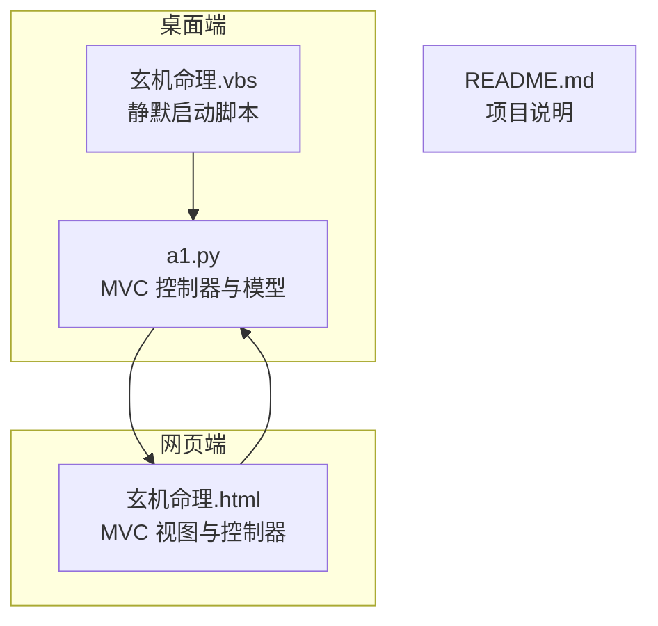
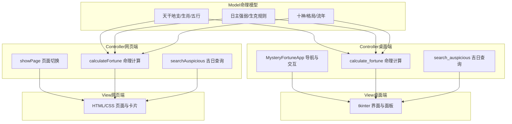
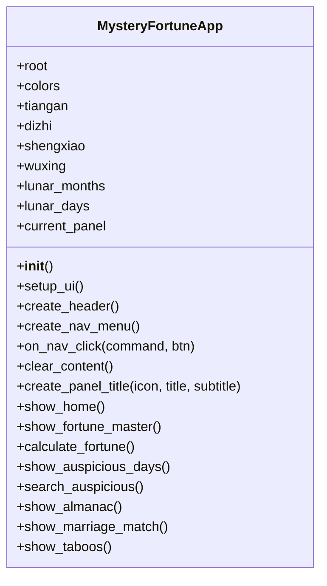
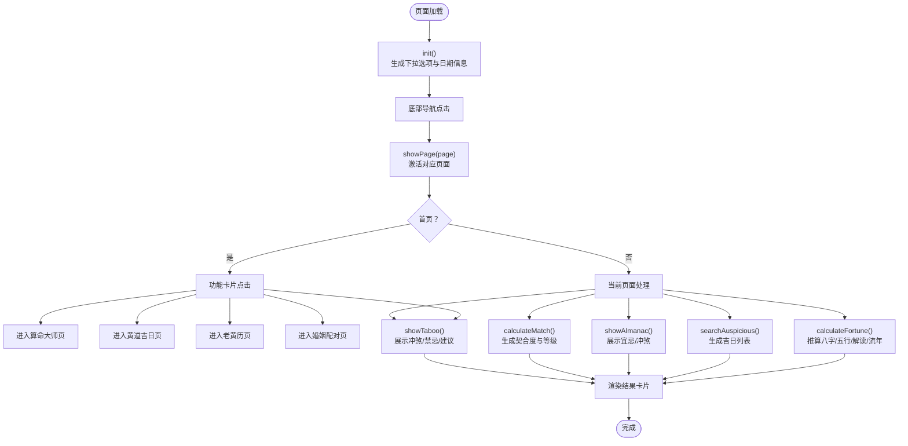
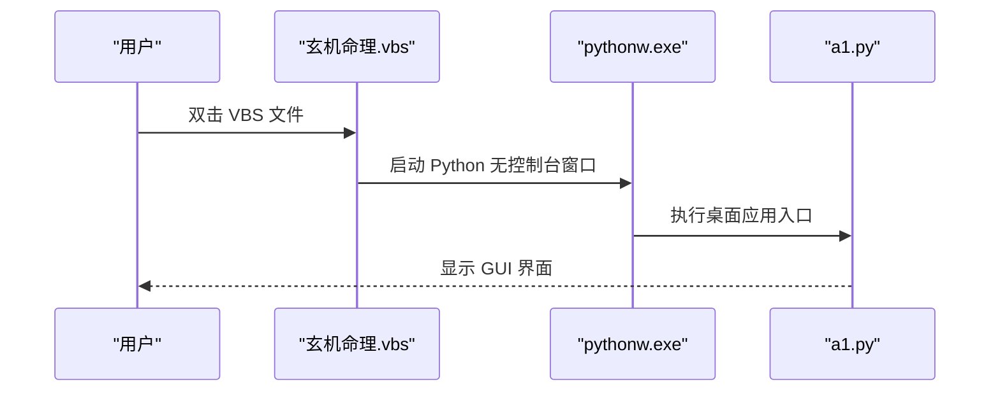
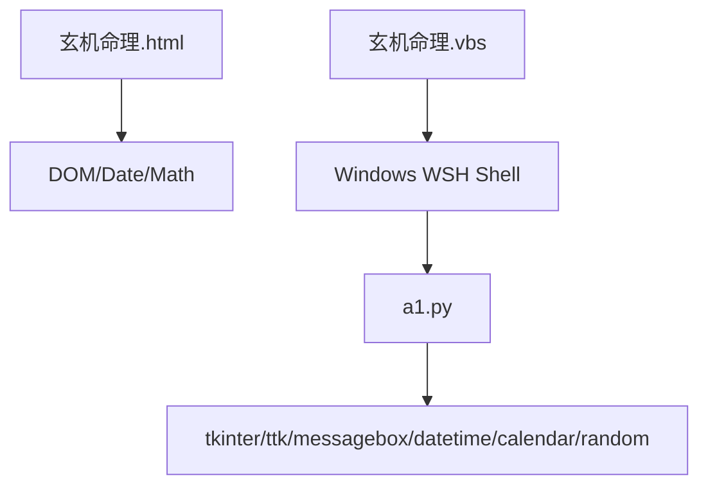

# 项目概述

<cite>
**本文引用的文件**
- [README.md](file://README.md)
- [a1.py](file://a1.py)
- [玄机命理.html](file://玄机命理.html)
- [玄机命理.vbs](file://玄机命理.vbs)
</cite>

## 目录
1. [引言](#引言)
2. [项目结构](#项目结构)
3. [核心组件](#核心组件)
4. [架构总览](#架构总览)
5. [详细组件分析](#详细组件分析)
6. [依赖关系分析](#依赖关系分析)
7. [性能考量](#性能考量)
8. [故障排查指南](#故障排查指南)
9. [结论](#结论)
10. [附录](#附录)

## 引言
本项目“制心一处 无坚不摧”是一个双平台命理分析工具，旨在为用户提供一致的跨平台体验：桌面端通过 Python tkinter 构建的 GUI 应用，网页端通过 HTML/CSS/JavaScript 实现。项目围绕中国传统文化中的命理体系，提供“算命大师”“黄道吉日”“老黄历”“婚姻配对”“今日禁忌”等核心功能，采用 MVC 架构组织代码，Model 负责命理数据与规则，View 负责桌面与网页界面展示，Controller 负责用户交互与命理计算逻辑。

项目目标明确：通过统一的算法与数据模型，在桌面与网页两端实现一致的命理分析结果，帮助用户趋吉避凶、把握时机。

## 项目结构
项目由四个核心文件组成，采用单层结构便于维护与快速理解：
- a1.py：桌面端 GUI 应用入口，包含完整的 MVC 实现与命理计算逻辑。
- 玄机命理.html：网页端界面与交互逻辑，提供与桌面端一致的功能视图。
- 玄机命理.vbs：静默启动脚本，用于在 Windows 环境下无控制台窗口启动桌面端应用。
- README.md：项目背景与用途说明。

图表来源
- [a1.py](file://a1.py#L1-L120)
- [玄机命理.html](file://玄机命理.html#L1-L120)
- [玄机命理.vbs](file://玄机命理.vbs#L1-L3)

章节来源
- [README.md](file://README.md#L1-L3)
- [a1.py](file://a1.py#L1-L120)
- [玄机命理.html](file://玄机命理.html#L1-L120)
- [玄机命理.vbs](file://玄机命理.vbs#L1-L3)

## 核心组件
- Model（命理数据模型）
  - 天干地支、生肖、五行、农历等基础数据与映射。
  - 命理规则：日主强弱判断、五行生克、十神与格局、流年运势评估等。
- View（界面层）
  - 桌面端：a1.py 使用 tkinter 构建导航菜单、功能面板、输入表单与结果展示。
  - 网页端：玄机命理.html 使用 CSS/JS 构建页面切换、输入控件与结果渲染。
- Controller（交互与计算）
  - 桌面端：MysteryFortuneApp 类集中处理用户点击、输入校验、命理计算与结果渲染。
  - 网页端：HTML 中的 JavaScript 函数负责页面切换、输入处理、命理计算与 DOM 更新。

章节来源
- [a1.py](file://a1.py#L35-L120)
- [玄机命理.html](file://玄机命理.html#L447-L570)

## 架构总览
项目采用 MVC 架构，Model 位于桌面端 a1.py 的数据与规则定义，View 分布于 a1.py 的 GUI 与 玄机命理.html 的网页界面，Controller 则分别在两处执行用户交互与命理计算。

图表来源
- [a1.py](file://a1.py#L116-L200)
- [a1.py](file://a1.py#L234-L609)
- [a1.py](file://a1.py#L610-L700)
- [玄机命理.html](file://玄机命理.html#L514-L570)
- [玄机命理.html](file://玄机命理.html#L572-L734)
- [玄机命理.html](file://玄机命理.html#L736-L825)
- [玄机命理.html](file://玄机命理.html#L827-L879)

## 详细组件分析

### 桌面端 GUI（a1.py）
- 初始化与主题
  - 设置窗口标题、尺寸、背景色与禁用缩放。
  - 定义配色方案与常用数据（天干地支、生肖、五行、农历）。
- 导航与面板
  - 顶部信息栏与左侧导航菜单，点击切换不同功能面板。
  - 面板标题、副标题与日期信息动态生成。
- 功能面板
  - 首页：功能卡片网格，引导用户进入各功能。
  - 算命大师：出生日期/时辰输入，触发命理计算并滚动展示报告。
  - 黄道吉日：事件类型选择，随机生成近三个月吉日列表。
  - 老黄历：当日宜忌、冲煞、吉神凶煞等信息展示。
  - 婚姻配对：生肖输入，生成契合度与等级。
  - 今日禁忌：当日冲煞与禁忌事项，提供化解建议。
- 命理计算引擎
  - 八字推算：根据年、月、日、时计算四柱天干地支。
  - 五行统计：统计天干地支对应的五行数量，判断日主强弱。
  - 喜用神与忌神：基于生克关系与日主强弱确定。
  - 流年运势：根据当前年份天干地支与日主五行关系评估流年吉凶。
  - 一生命运概述：按日主五行与强弱生成阶段性运势解读。

图表来源
- [a1.py](file://a1.py#L10-L120)
- [a1.py](file://a1.py#L116-L200)
- [a1.py](file://a1.py#L234-L609)
- [a1.py](file://a1.py#L610-L700)

章节来源
- [a1.py](file://a1.py#L10-L120)
- [a1.py](file://a1.py#L116-L200)
- [a1.py](file://a1.py#L234-L609)
- [a1.py](file://a1.py#L610-L700)

### 网页端界面（玄机命理.html）
- 页面结构
  - 顶部标题与日期信息，底部固定导航栏。
  - 首页功能卡片网格，点击进入对应功能页。
  - 各功能页：算命大师、黄道吉日、老黄历、婚姻配对、今日禁忌。
- 数据与规则
  - 天干地支、生肖、五行、农历等基础数据与映射。
  - 农历年份特定农历数据与通用农历推导函数。
- 交互逻辑
  - 页面切换：showPage 根据导航激活对应页面并更新底部导航状态。
  - 初始化：init 生成年月日下拉选项、默认值与日期信息。
  - 命理计算：calculateFortune 推算八字、统计五行、判断强弱、生成解读与流年运势。
  - 吉日查询：searchAuspicious 随机生成近三个月吉日列表。
  - 老黄历：showAlmanac 展示当日宜忌、冲煞与吉神凶煞。
  - 婚姻配对：calculateMatch 生成契合度与等级，展示各项指标进度条。
  - 今日禁忌：showTaboo 展示当日冲煞、禁忌事项与化解建议。

图表来源
- [玄机命理.html](file://玄机命理.html#L514-L570)
- [玄机命理.html](file://玄机命理.html#L572-L734)
- [玄机命理.html](file://玄机命理.html#L736-L825)
- [玄机命理.html](file://玄机命理.html#L827-L879)

章节来源
- [玄机命理.html](file://玄机命理.html#L1-L120)
- [玄机命理.html](file://玄机命理.html#L447-L570)
- [玄机命理.html](file://玄机命理.html#L572-L734)
- [玄机命理.html](file://玄机命理.html#L736-L825)
- [玄机命理.html](file://玄机命理.html#L827-L879)

### VBS 脚本与静默启动
- 玄机命理.vbs 使用 WSH Shell 对象调用 pythonw.exe 执行 a1.py，实现无控制台窗口的静默启动。
- 该脚本将桌面快捷方式与启动行为解耦，便于用户直接双击运行桌面端应用。

图表来源
- [玄机命理.vbs](file://玄机命理.vbs#L1-L3)
- [a1.py](file://a1.py#L10-L20)

章节来源
- [玄机命理.vbs](file://玄机命理.vbs#L1-L3)

### 两个平台算法一致性保障
- 数据与规则来源一致：桌面端与网页端均使用相同的天干地支、生肖、五行映射与命理规则。
- 关键计算步骤一致：八字推算、五行统计、日主强弱判断、喜用神与忌神、流年运势评估、婚姻配对评分等均在同一逻辑框架下实现。
- 结果呈现差异：桌面端使用 tkinter 卡片与滚动区域，网页端使用 CSS 卡片与响应式布局，但核心数据与算法保持一致。

章节来源
- [a1.py](file://a1.py#L234-L609)
- [玄机命理.html](file://玄机命理.html#L572-L734)

## 依赖关系分析
- 外部依赖
  - 桌面端：Python 标准库（tkinter、ttk、messagebox、datetime、calendar、random）。
  - 网页端：浏览器内置对象（DOM、Date、Math）与标准 CSS/HTML。
- 内部依赖
  - a1.py 与 玄机命理.html 在命理模型与规则层面相互独立，但在功能与数据上保持一致。
  - VBS 依赖 Windows 系统的 WSH Shell 与 Python 环境。

图表来源
- [a1.py](file://a1.py#L1-L15)
- [玄机命理.html](file://玄机命理.html#L1-L40)
- [玄机命理.vbs](file://玄机命理.vbs#L1-L3)

章节来源
- [a1.py](file://a1.py#L1-L15)
- [玄机命理.html](file://玄机命理.html#L1-L40)
- [玄机命理.vbs](file://玄机命理.vbs#L1-L3)

## 性能考量
- 计算复杂度
  - 命理计算主要为常数时间操作（查表、映射、简单统计），整体 O(1)，性能开销极低。
- 界面渲染
  - 桌面端使用 Canvas + Scrollbar 实现滚动区域，避免大量控件一次性渲染导致卡顿。
  - 网页端使用 CSS Grid 与 Flex 布局，配合少量 JavaScript 动态更新，渲染效率高。
- 资源占用
  - VBS 静默启动避免控制台窗口占用资源。
  - 项目体量小，内存与 CPU 占用低，适合在普通 PC 上流畅运行。

## 故障排查指南
- 无法启动桌面端
  - 确认已安装 Python 环境且可执行 pythonw。
  - 检查 VBS 路径是否正确指向 a1.py。
- 网页端无法打开
  - 确认浏览器支持现代 CSS/JS 语法。
  - 若本地文件访问受限，尝试通过本地服务器或启用本地文件访问权限。
- 命理结果异常
  - 检查输入的出生日期/时辰是否合理。
  - 确认系统时间与地区设置正确，以保证农历与星期计算准确。
- 界面显示问题
  - 桌面端：检查 tkinter 版本与系统字体支持。
  - 网页端：更换浏览器或清除缓存后重试。

章节来源
- [玄机命理.vbs](file://玄机命理.vbs#L1-L3)
- [a1.py](file://a1.py#L116-L200)
- [玄机命理.html](file://玄机命理.html#L1-L120)

## 结论
本项目以简洁的单层结构实现了双平台命理分析工具，桌面端与网页端共享一致的命理模型与规则，通过 MVC 架构清晰分离了数据、界面与交互逻辑。VBS 脚本提供了静默启动能力，提升了用户体验。对于初学者，建议从 Python 基础与 tkinter 入门开始，逐步掌握前端基础与命理知识；对于高级开发者，可在现有模块基础上扩展新的命理功能或接入外部 API，保持算法一致性与界面风格统一。

## 附录
- 学习路径建议
  - 初学者
    - Python 基础语法与标准库
    - tkinter GUI 编程（窗口、控件、事件绑定）
    - HTML/CSS/JavaScript 基础
    - 中国传统文化中的命理知识（天干地支、五行、生肖、八字）
  - 高级开发者
    - 新增命理功能模块：在 a1.py 中扩展 Model 与 Controller，同时在 玄机命理.html 中同步实现相应逻辑。
    - 集成外部 API：通过网络请求获取实时数据（如节气、节气物候），并在两平台统一展示。
    - 算法一致性保障：建立测试用例，覆盖关键命理计算步骤，确保桌面与网页端结果一致。